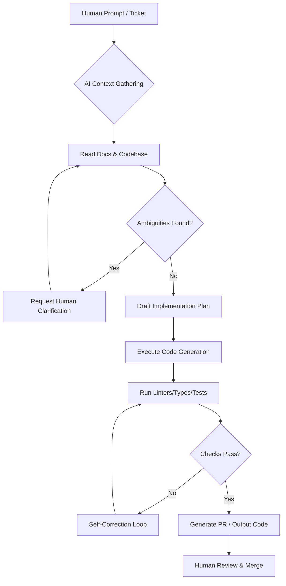
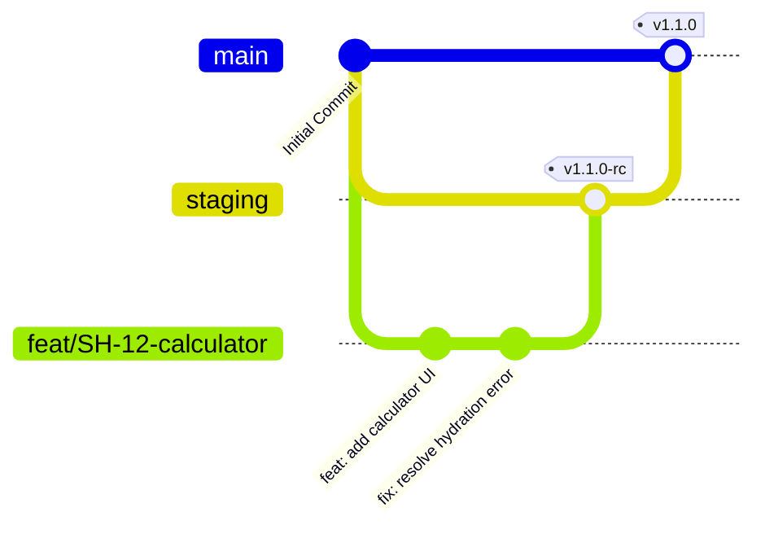
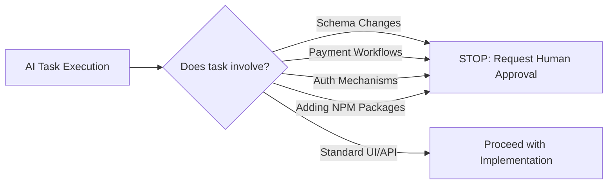

---
# COVER PAGE

**Document ID:** SHNG-AI-001
**Title:** AI Development & Antigravity Implementation Guide
**Project Name:** Gridless Africa (formerly SolarHub NG)
**Version:** 1.0
**Date:** July 16, 2026
**Status:** Draft for Review
**Author:** Principal Software Architect / AI Engineering Lead
**Intended Audience:** Human Engineers, AI Coding Assistants (Cursor, Copilot, Gemini, Antigravity Agents)
**Approval Status:** Pending

---

## Change Log

| Version | Date | Author | Summary of Changes |
| :--- | :--- | :--- | :--- |
| **1.0** | July 16, 2026 | Principal AI Lead | Initial Baseline. Defines strict operational parameters for all AI-assisted engineering tasks. |

## Related Documents & Dependencies
* **SHNG-CON-001** Project Constitution v1.0
* **SHNG-ARCH-001** Technical Architecture v1.0
* **SHNG-FE-001** Frontend Technical Specification v1.0
* **SHNG-BE-001** Backend Technical Specification v1.0
* **SHNG-QA-001** QA & Testing Strategy v1.0

## Approval Workflow
1.  **Draft Review:** Technical Program Manager & Staff Product Engineer (Pending)
2.  **Process Alignment:** Senior Engineering Manager (Pending)
3.  **Final Sign-off:** CTO (Pending)

---

## 1. Purpose
The AI Development & Antigravity Implementation Guide (SHNG-AI-001) is the operational operating system for Gridless Africa. It dictates exactly how AI coding assistants and autonomous agents must interpret, plan, and execute code within our repository. By establishing strict behavioral guardrails, document hierarchies, and quality gates, this guide prevents AI hallucinations, architectural drift, and unauthorized scope creep, ensuring that AI accelerates development while maintaining enterprise-grade reliability and security.

---

## 2. AI Roles & Responsibilities

### Authorized AI Responsibilities
* **Feature Implementation:** Generating UI components, API routes, and database schemas strictly according to approved specifications.
* **Refactoring (Scoped):** Improving code readability, optimizing performance, or DRYing (Don't Repeat Yourself) logic *within the boundaries of the current task*.
* **Bug Fixing:** Identifying root causes based on stack traces and implementing targeted fixes.
* **Testing:** Generating Unit and E2E tests based on the criteria in SHNG-QA-001.
* **Documentation:** Adding JSDoc comments and updating inline code documentation.
* **Code Review Support:** Analyzing human-written PRs for security flaws, performance bottlenecks, and style violations.

### Unauthorized Actions (AI Must Refuse or Request Human Approval)
* **DO NOT** change the approved technology stack (e.g., swapping Supabase for Firebase).
* **DO NOT** modify approved business logic or PRD constraints (e.g., changing the max 3-bid rule).
* **DO NOT** commit secrets or hardcode sensitive environment variables.
* **DO NOT** execute systemic, cross-domain refactoring without explicit human authorization.
* **DO NOT** overwrite approved architectural documents. Produce an **AI Development Recommendation (ADR)** instead.

---

## 3. Document Hierarchy & Precedence
When AI detects conflicting instructions between the user's prompt, the codebase, and the documentation, it must resolve the conflict using the following strict hierarchy of authority (1 being the highest):

1. **User Correction Ledger / Immediate Human Prompt Constraints** (Overrides all)
2. **SHNG-CON-001** (Project Constitution)
3. **SHNG-SEC-001** (Security Architecture)
4. **SHNG-PRD-001** (Product Requirements Document)
5. **SHNG-ARCH-001 / SHNG-DB-001 / SHNG-API-001** (Core Tech Specs)
6. **SHNG-UX-001 / SHNG-WF-001 / SHNG-DS-001** (Design & UX Specs)
7. **SHNG-FE-001 / SHNG-BE-001** (Implementation Specs)
8. **SHNG-SPR-001** (Sprint Plan & Product Roadmap)
9. **SHNG-AI-001** (This Guide)

*Conflict Resolution:* If a lower-tier document contradicts a higher-tier document, the AI must follow the higher-tier document and notify the human operator of the discrepancy.

---

## 4. Required Document Reading Order
Before generating *any* code for a new task, the AI agent MUST execute the following cognitive protocol:

1. **Read `PROJECT-INDEX.md`:** Understand the current state of the project.
2. **Read `SHNG-AI-001` (This Document):** Load operational guardrails.
3. **Identify Context:** Fetch the specific PRD section, API spec, and Wireframe spec related to the prompt.
4. **Summarize Intent:** Output a brief, 1-2 sentence summary of what it is about to build.
5. **Identify Ambiguities:** Check for missing data (e.g., "The prompt asks for a payment button, but SHNG-API-001 does not specify the endpoint").
6. **Request Clarification:** If ambiguities exist that violate strict typing or security, STOP and ask the human. Otherwise, proceed.

---

## 5. Development Workflow



---

## 6. Incremental Development Rules
* **Single Responsibility:** Build one feature, fix one bug, or address one component at a time. Do not bundle a UI update with a database schema migration unless explicitly instructed.
* **No Speculative Features:** Do not build "nice-to-have" features that are not in the PRD (e.g., do not add a dark-mode toggle if it is scheduled for Phase 3).
* **Focused Commits:** Keep generated code strictly isolated to the files required for the specific task.

---

## 7. Coding Standards Summary
*(AI must cross-reference detailed SHNG-FE-001 and SHNG-BE-001 specs)*
* **TypeScript:** Strict mode. `any` is forbidden. Explicit interfaces for all API payloads.
* **React/Next.js:** Server Components by default. `"use client"` only at the leaf nodes where interactivity is required.
* **Tailwind CSS:** Use the `cva` library for component variants. Do not use arbitrary values (e.g., `w-[321px]`) unless absolutely necessary.
* **Supabase:** Always use the typed Supabase client. Enforce RLS on all queries.
* **Error Handling:** Wrap API calls in `try/catch`. Never expose raw stack traces to the frontend.

---

## 8. Quality Gates
Before declaring a task "Ready for Review," the AI must silently verify:
1. **Functional:** Does the code satisfy the Acceptance Criteria in the prompt?
2. **Typing:** Are there zero TypeScript compilation errors?
3. **UI/UX:** Does the component use approved Design Tokens (SHNG-DS-001)?
4. **Security:** Are inputs validated via Zod? Are DB queries protected by RLS?
5. **Performance:** Are heavy libraries lazy-loaded? Are images optimized?

---

## 9. Pull Request Expectations
When asked to generate a Pull Request description, the AI must output the following format:
* **Title:** `type(scope): concise description` (e.g., `feat(auth): add installer KYC upload`)
* **Summary of Changes:** Bulleted list of technical changes.
* **Files Modified:** List of critical files altered.
* **Reasoning:** Why this approach was taken.
* **Risks:** Potential side effects (e.g., "This modifies the global Button component, check all usages").
* **Suggested Manual Tests:** 1-2 steps for the human reviewer to verify the feature.

---

## 10. Definition of Done (DoD)
A feature generated by AI is only considered "Done" when:
- [ ] Code is fully generated and implements the requested feature.
- [ ] TypeScript compiler passes with zero errors.
- [ ] ESLint and Prettier formatting rules are satisfied.
- [ ] Zod schemas exist for any new data structures.
- [ ] RLS policies are attached to any new database tables.
- [ ] Unit tests (if requested) pass.
- [ ] No hardcoded secrets exist in the output.

---

## 11. Feature Request Template
*Humans should use this template when prompting AI to guarantee predictable output.*

```markdown
**Objective:** [e.g., Build the Installer Quote Submission Form]
**User Story:** As an [Installer], I want to [input line items and labor costs] so that I can [submit a bid to a customer].
**Acceptance Criteria:**
1. Form must allow dynamic addition/removal of line items.
2. Must validate that total cost > 0.
3. Must submit to `POST /api/v1/quotes`.
**Relevant Documents:** SHNG-PRD-001 (Section 7.3), SHNG-WF-001 (INS-03).
**Constraints:** Use React Hook Form and Zod.
**Out of Scope:** Do not build the backend API route, only the frontend UI.
```

---

## 12. Bug Fix Workflow
1. **Reproduce & Analyze:** AI analyzes the provided error log or bug description.
2. **Root Cause Identification:** AI states the hypothesized root cause before writing code.
3. **Minimal Fix:** AI proposes the least invasive code change required to fix the bug.
4. **Regression Check:** AI identifies what other components rely on the modified function.
5. **Verification Plan:** AI provides a snippet or manual test step to prove the fix works.

---

## 13. Refactoring Policy
* **Local Refactoring:** AI is encouraged to apply the "Boy Scout Rule" (leave code better than you found it) within the specific function or component it is currently modifying.
* **Systemic Refactoring:** AI MUST NOT initiate cross-file, architectural refactoring (e.g., changing how state is managed globally) without first generating a recommendation and receiving explicit human approval.

---

## 14. Git & Branching Strategy



* **Branch Naming:** `type/ticket-description` (e.g., `feat/auth-flow`, `fix/header-alignment`, `chore/deps-update`).
* **Commit Messages:** Conventional Commits standard.

---

## 15. Security Rules
* **No Secrets:** AI must never output or accept actual API keys, passwords, or production database URIs in prompts. Always use `.env` placeholders (e.g., `process.env.NEXT_PUBLIC_MAPS_KEY`).
* **Input Validation:** All user inputs must pass through Zod before reaching the database or DOM.
* **Least Privilege:** When generating DB schemas, AI must default to denying all access and opening specific RLS policies only as needed.

---

## 16. Documentation Maintenance
If an AI implements a feature that deviates slightly from an approved specification (due to technical necessity or package updates), it must:
1. Implement the code.
2. Inform the human of the deviation.
3. Generate a Markdown snippet to update the relevant specification document (e.g., updating the API Spec with a newly required parameter).

---

## 17. Human Approval Gates


AI must halt generation and wait for human confirmation if a task intersects with Database Schemas, Payment Gateways, Authentication Logic, or introducing new third-party dependencies.

---

## 18. AI Failure Recovery
If the AI encounters a scenario it cannot resolve:
* **Conflicting Requirements:** State the conflict clearly (e.g., "The PRD requests Paystack, but the prompt asks for Stripe. Please clarify.") and halt.
* **Build Failures / Type Errors:** Analyze the terminal output, identify the specific line causing the failure, propose a fix, and ask for permission to apply it.
* **Context Window Limits:** If the required context exceeds the AI's memory window, the AI should instruct the user to break the task down into smaller, sequential prompts.

---

## 19. Continuous Improvement (ADRs)
If the AI identifies a suboptimal pattern in the locked architecture (e.g., noticing that a requested DB query will cause an N+1 performance issue), it must:
1. Complete the task safely as requested (if possible).
2. Generate an **AI Development Recommendation (ADR)** block at the end of its response, explaining the issue and proposing an optimized architectural change for the human to review.

---

## 20. Appendices

### 20.1 Code Review Checklist (For AI Reviewing Human Code)
- [ ] Are Zod schemas used for all ingress data?
- [ ] Is RLS enabled on new tables?
- [ ] Are Server Actions properly authenticating the user session?
- [ ] Are Tailwind utility classes used efficiently without bloat?
- [ ] Are error boundaries and loading states implemented?

### 20.2 AI Prompt Template for Component Generation
```text
Role: Act as a Senior Next.js/Tailwind Engineer.
Task: Create the [Component Name] based on SHNG-DS-001.
Props required: [prop1], [prop2].
Behavior: [describe interaction].
Output: Provide the complete TypeScript file using React Server Components where applicable.
```

---
*Document Footer: Gridless Africa - AI Development & Implementation Guide v1.0*