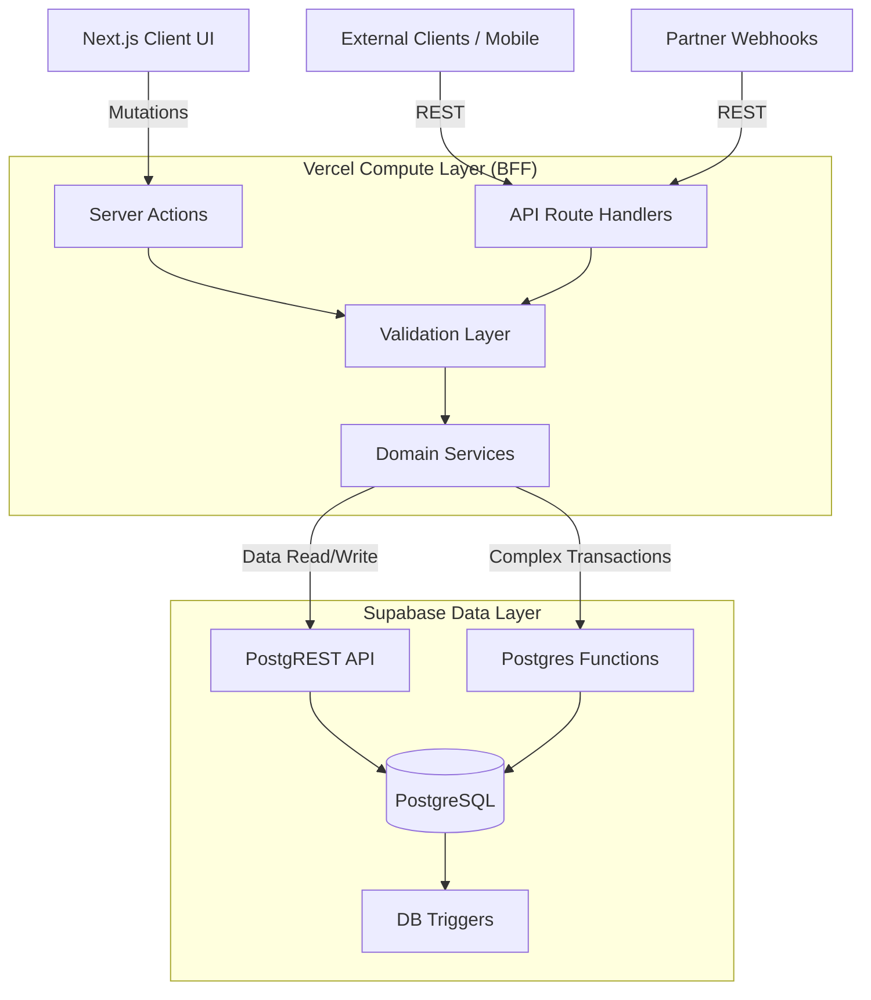

---
# COVER PAGE

**Document ID:** SHNG-BE-001
**Title:** Backend Technical Specification
**Project Name:** Gridless Africa (formerly SolarHub NG)
**Version:** 1.0
**Date:** July 16, 2026
**Status:** Draft for Review
**Author:** Principal Backend Architect
**Intended Audience:** Backend Engineers, Full-Stack Developers, Database Administrators, DevSecOps
**Approval Status:** Pending

---

## Change Log

| Version | Date | Author | Summary of Changes |
| :--- | :--- | :--- | :--- |
| **1.0** | July 16, 2026 | Principal Backend Architect | Initial Baseline. Aligned with Technical Architecture v1.0, Database Design v1.0, and API Specification v1.0. |

## Related Documents & Dependencies
* **SHNG-CON-001** Project Constitution v1.0
* **SHNG-ARCH-001** Technical Architecture v1.0
* **SHNG-DB-001** Database Design v1.0
* **SHNG-API-001** API Specification v1.0
* **SHNG-SEC-001** Security Architecture v1.0

## Approval Workflow
1.  **Draft Review:** Database Architect & Cloud Engineer (Pending)
2.  **Security Alignment:** Security Architect (Pending)
3.  **Final Sign-off:** CTO (Pending)

---

## 1. Executive Summary
The Backend Technical Specification (SHNG-BE-001) establishes the engineering blueprint for the server-side operations of Gridless Africa. Acting as the secure orchestrator between our Next.js frontend, our Supabase (PostgreSQL) data layer, and third-party financial services, this backend is designed for high data integrity, strict access control, and asynchronous resilience. This document defines how business rules are enforced, how state transitions are managed transactionally, and how the system scales to meet the "API-First" and "Security-First" mandates of the Project Constitution.

---

## 2. Backend Objectives
* **Scalability:** Ability to handle spikes in traffic from the Solar Savings Calculator SEO strategy using serverless/edge compute.
* **Reliability:** Idempotent processing of financial webhooks to guarantee Escrow integrity even during network blips.
* **Security:** Defense-in-depth leveraging Vercel WAF, Zod schema validation, and PostgreSQL Row-Level Security (RLS).
* **Performance:** Sub-200ms API response times through connection pooling (Supavisor) and optimized queries.
* **Maintainability:** Domain-driven service isolation inside the Next.js API/Action layer.
* **Modularity:** Decoupled external integrations (Payments, Emails) allowing easy swapping of vendors.
* **Observability:** End-to-end request tracing and structured logging for rapid incident resolution.
* **Cost Efficiency:** Maximizing serverless scale-to-zero capabilities during off-peak hours for the MVP phase.

---

## 3. Backend Technology Stack

| Technology | Purpose | Benefits | Trade-offs |
| :--- | :--- | :--- | :--- |
| **Supabase** | Backend-as-a-Service (BaaS) | Instant REST/GraphQL APIs, native Postgres integration, built-in Auth & Storage. | Vendor ecosystem lock-in (though underlying Postgres mitigates data lock-in). |
| **PostgreSQL** | Primary Database | Relational integrity, RLS, JSONB support, powerful trigger functions. | Requires connection pooling at scale to prevent exhaustion. |
| **Supabase Auth** | IAM & Authentication | JWT management, seamless sync with Postgres RLS for secure querying. | Custom auth flows require workarounds or Edge Functions. |
| **Supabase Storage** | File & Media Storage | S3-compatible, natively protected by RLS for sensitive KYC docs. | CDN edge caching requires proper configuration for public assets. |
| **Vercel Edge/Serverless**| API & Compute Layer | Zero cold-start latency (Edge), infinite scaling, auto-managed CI/CD. | 10-second timeout limits on Edge; requires offloading heavy tasks. |
| **Vercel Cron** | Background Jobs | Native scheduling without deploying separate worker dynos. | Strict execution time limits; not suited for heavy ETL tasks. |
| **Resend** | Transactional Email | React Email support, high deliverability, developer-friendly API. | Relatively new compared to SendGrid, though highly performant. |
| **Paystack** | Primary Escrow Gateway | Dominant in Nigeria, high uptime, robust webhook infrastructure. | API latency during peak regional banking hours. |
| **Flutterwave** | Secondary / Phase 2 Gateway | Cross-border support, redundancy for Paystack. | Excluded from MVP (via ADR 002) to reduce integration surface area; retained for future growth. |

---

## 4. Backend Architecture

### 4.1 Service Boundaries & Integration Layer
The backend logic resides primarily within the Next.js framework (acting as a Backend-For-Frontend/BFF). It utilizes two distinct patterns:
1.  **Server Actions:** Used for direct mutations from the Gridless Africa UI (e.g., submitting a quote).
2.  **Route Handlers (`/api/v1/*`):** Used for external integrations (Webhooks) and fulfilling the API-First mandate for future mobile clients.

---

## 5. Authentication & Authorization

* **Registration/Login:** Handled via `@supabase/ssr`. The backend exchanges credentials for a session, setting HTTP-only, secure cookies.
* **Email Verification:** Supabase handles the generation of OTPs/Magic Links. The backend intercepts the callback to finalize the session.
* **Session Validation:** Every protected API route or Server Action invokes `supabase.auth.getUser()`. If invalid, execution halts (`401 Unauthorized`).
* **RBAC (Role-Based Access Control):** A Postgres trigger automatically populates the `public.user_roles` table upon user registration. Custom claims are injected into the JWT, allowing the backend to perform fast `role === 'installer'` checks without querying the database.
* **Future MFA / Binance Wallet:** The architecture abstracts authentication into an `AuthService`. Future Web3 sign-ins will utilize a custom Next.js endpoint to verify cryptographic nonces before manually minting a Supabase session.

---

## 6. Business Domains

| Domain | Responsibilities | Core Business Rules |
| :--- | :--- | :--- |
| **Users/Profiles** | Identity and demographics. | Profiles tied 1:1 with Auth records. |
| **Installers/Companies**| Vetting and directory listings. | Must have `KYC_VERIFIED` state to bid. |
| **Marketplace/Products**| Hardware catalog management. | Read-heavy; modified only by Admins/Vendors. |
| **Quotes/Requests** | Matching leads to installers. | Max 3 bids per request. Hard expiration rules. |
| **Projects/Installations**| Lifecycle and milestone tracking. | State strictly sequential (Quoted -> Escrow -> WIP -> Done). |
| **Payments** | Escrow ledgers and Webhook tracking. | Idempotent updates required. State dictates Project progression. |
| **Maintenance/Warranties**| Post-installation support (Phase 2). | Driven by installation completion dates. |
| **Reviews** | Trust building and scoring. | Only permitted on `COMPLETED` projects. |
| **Notifications** | Event routing (Email/In-App). | Asynchronous; must not block main thread. |
| **Admin/Reporting** | Platform oversight and moderation. | Strict MFA required for read/write access. |

---

## 7. Business Logic (Key Workflows)

### 7.1 Quote Comparison & Acceptance
* **Validation:** Verify the customer owns the `quote_request`, the `quote` is in `PENDING` state, and the quote has not expired.
* **State Transition:** 1. Update selected `quote` to `ACCEPTED`.
    2. Update sibling quotes (for the same request) to `REJECTED`.
    3. Generate a new row in the `projects` table linking the quote and customer.
* **Dependency:** This must be an atomic transaction (All or Nothing).

### 7.2 Payment Confirmation (Webhook)
* **Validation:** Compute HMAC SHA512 signature using `PAYSTACK_SECRET_KEY` against the request body. Compare with `x-paystack-signature` header.
* **State Transition:** Check if `reference` exists in `payments` table. If `status !== 'SUCCESS'`, update to `SUCCESS` (Held in Escrow) and trigger the Project state to `IN_PROGRESS`.
* **Idempotency:** If the payment is already marked `SUCCESS`, return `200 OK` immediately without mutating the DB.

---

## 8. Database Interaction Strategy
* **Data Access Principles:** Direct SQL queries from the Node layer are forbidden. All data access must use the typed Supabase JS client.
* **Transactions (Critical):** Because the Supabase REST API does not support multi-statement SQL transactions, complex operations (like Quote Acceptance) MUST be implemented as **Postgres RPCs (Stored Procedures)**. The backend will call `supabase.rpc('accept_quote', { quote_id: 123 })` to ensure ACID compliance.
* **Concurrency Handling:** Optimistic locking using an `updated_at` timestamp comparison will be used for high-contention Admin rows.
* **Audit Logging:** Enforced exclusively via Postgres triggers (defined in SHNG-DB-001) to ensure bypass is impossible, even from a compromised backend route.

---

## 9. API Implementation Strategy
* **Request Processing:** Standardized middleware chain: Rate Limit Check -> JWT Auth Check -> Role Check -> Controller.
* **Validation:** `Zod` schemas define the exact payload shape. Invalid requests return a standardized `400 Bad Request` with an array of field-level errors.
* **Pagination:** Cursor-based pagination (`?cursor=uuid&limit=20`) utilized for feeds to prevent DB degradation offset scanning.
* **Error Handling:** A global error wrapper catches exceptions, logs the raw error to the observability platform, and returns a sanitized `500` JSON response to the client.

---

## 10. File & Media Handling
* **Strategy:** Vercel API limits payload sizes (typically 4.5MB). To avoid bottlenecks, the backend generates **Signed Pre-Signed URLs** via Supabase Storage.
* **Workflow:** 1. Client requests upload URL (providing file name/MIME type).
    2. Backend validates user role and MIME type (e.g., only PDF/JPG for KYC).
    3. Backend returns signed URL.
    4. Client uploads directly to Supabase Storage.
    5. Client sends final storage path reference back to the Gridless API to attach to the DB record.

---

## 11. Payment Processing
* **Payment Initiation:** Client requests checkout -> Backend generates unique transaction reference -> Calls Paystack API (`/transaction/initialize`) -> Returns Checkout URL to client.
* **Financial Reconciliation:** Backend stores the exact amount expected. Upon webhook receipt, backend validates that `webhook_amount === expected_amount` to prevent partial payment exploits.
* **Refund Workflow:** Processed manually by Admins via the Paystack dashboard for MVP; logged locally via webhooks.

---

## 12. Notification Services
* **Architecture:** Event-Driven. 
* **Triggering:** Database webhooks (pg_net) trigger an internal Next.js API route when specific table rows change (e.g., `projects.status` changes to `IN_PROGRESS`).
* **Delivery Strategy (Email):** The internal API formats data into a React Email template and pushes the payload to the Resend API asynchronously.
* **Delivery Strategy (In-App):** Rows are inserted into the `notifications` table, which the client fetches via polling or Supabase Realtime subscriptions.

---

## 13. Background Jobs
Managed via **Vercel Cron** invoking protected Next.js API endpoints (`/api/v1/cron/*`).
* **Quote Expiration Sweep:** Hourly job. Finds `PENDING` quotes older than 7 days and updates status to `EXPIRED`.
* **Lead Stagnation:** Daily job. Alerts admins to `OPEN` quote requests older than 48 hours with 0 bids.
* **Security:** Cron endpoints validate a pre-shared secret (`CRON_API_KEY`) passed in the Authorization header to prevent external triggering.

---

## 14. Security Implementation
* **Secret Management:** Environment variables (`.env`) injected at build/runtime via Vercel. Supabase service-role keys are strictly isolated to secure backend contexts and never exposed to the client.
* **Abuse Prevention:** Vercel Edge Middleware acts as a WAF, rate-limiting based on IP and User-Agent heuristics before traffic reaches the Node.js runtime.
* **Secure Error Handling:** Stack traces are stripped in production. Database schema hints (often leaked by PostgREST errors) are sanitized before reaching the HTTP response.

---

## 15. Monitoring & Observability
* **Structured Logging:** Utilizing `pino` or `winston`. Logs output as JSON containing `requestId`, `userId`, `action`, and `latency`.
* **Error Monitoring:** Sentry integrated into the Next.js backend configuration to capture unhandled exceptions and API timeouts.
* **Health Checks:** `GET /api/v1/health` verifies DB connection pool status and external API availability (Paystack, Resend).

---

## 16. Performance Optimisation
* **Connection Pooling:** Supavisor enforced for all backend DB connections to prevent Vercel serverless functions from overwhelming Postgres connections during traffic spikes.
* **Caching:** Utilizing Next.js `unstable_cache` for heavy, read-only catalog queries (e.g., fetching product brands).
* **Batch Processing:** Inserts for multiple Quote Line Items are batched into a single Supabase `.insert([])` array call rather than iterative `await` calls.

---

## 17. Disaster Recovery & Resilience
* **Failover Strategy:** If Paystack webhook processing fails (e.g., 500 error), Paystack will automatically retry exponentially. Our webhook endpoint is heavily idempotent to handle duplicate deliveries safely.
* **Graceful Degradation:** If Resend goes down, the core transactional flow (quoting/payments) will succeed, logging a secondary error for the failed email dispatch rather than rolling back the entire user transaction.

---

## 18. Future Backend Evolution
* **AI Energy Consultant:** The architecture accommodates Vercel AI SDK integrations. A new domain service (`AIService`) will stream completions back to the client using Server-Sent Events (SSE).
* **IoT Monitoring:** Requires a separate microservice (likely TimescaleDB/InfluxDB) for handling high-throughput time-series telemetry from solar inverters, decoupled from the core transactional Postgres DB.
* **Multi-Country Expansion:** Currency formatting and localization logic are abstracted to the service layer. DB schemas include `currency_code` columns on financial tables to support future non-NGN transactions.

---

## 19. Backend Risks & Mitigation

| Risk | Description | Mitigation Strategy |
| :--- | :--- | :--- |
| **Serverless Cold Starts** | Vercel functions taking >2s to boot during low-traffic periods, frustrating users. | Keep edge functions lightweight. Pre-warm critical paths (like the Calculator API) if necessary. |
| **Webhook Delivery Failures** | Dropped financial updates due to internal server errors during Paystack callbacks. | Implement a Fallback Polling cron job that checks Paystack API daily for pending transaction statuses. |
| **Database Connection Exhaustion** | Spike in Server Actions causing "too many clients" Postgres errors. | Strictly mandate Supavisor connection pooling string (`?pgbouncer=true`) for all backend clients. |

---

## 20. Backend Decision Recommendations (BDRs)

### BDR 001: Utilize Postgres RPCs for Complex Transactions
* **Context:** Supabase (via PostgREST) natively supports fast single-table CRUD operations. However, critical workflows—like "Accepting a Quote"—require updating a quote, rejecting other quotes, creating a project, and initializing a payment record atomically. Doing this via multiple chained API calls from the Next.js backend introduces race conditions and potential partial-state failures if the network drops mid-execution.
* **Recommendation:** Abstract all complex, multi-table write operations into PostgreSQL Stored Procedures (RPCs). The Next.js backend will simply call `supabase.rpc('process_quote_acceptance', { quote_id: ID })`. This guarantees ACID transactional compliance at the database level.

---

**Approval Checklist**
- [ ] Backend architecture aligns with the hybrid API/Server Action mandate.
- [ ] Payment webhook security and idempotency are strictly defined.
- [ ] Database transaction boundaries are identified and solved via RPC.
- [ ] Notification and Background Job orchestration strategies are clear.

*Document Footer: Gridless Africa - Backend Technical Specification v1.0*