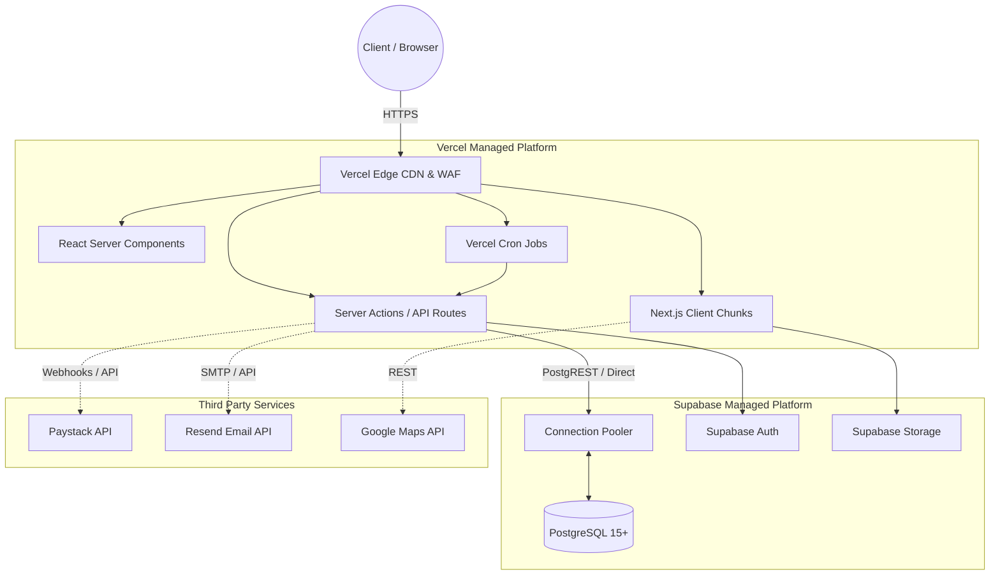
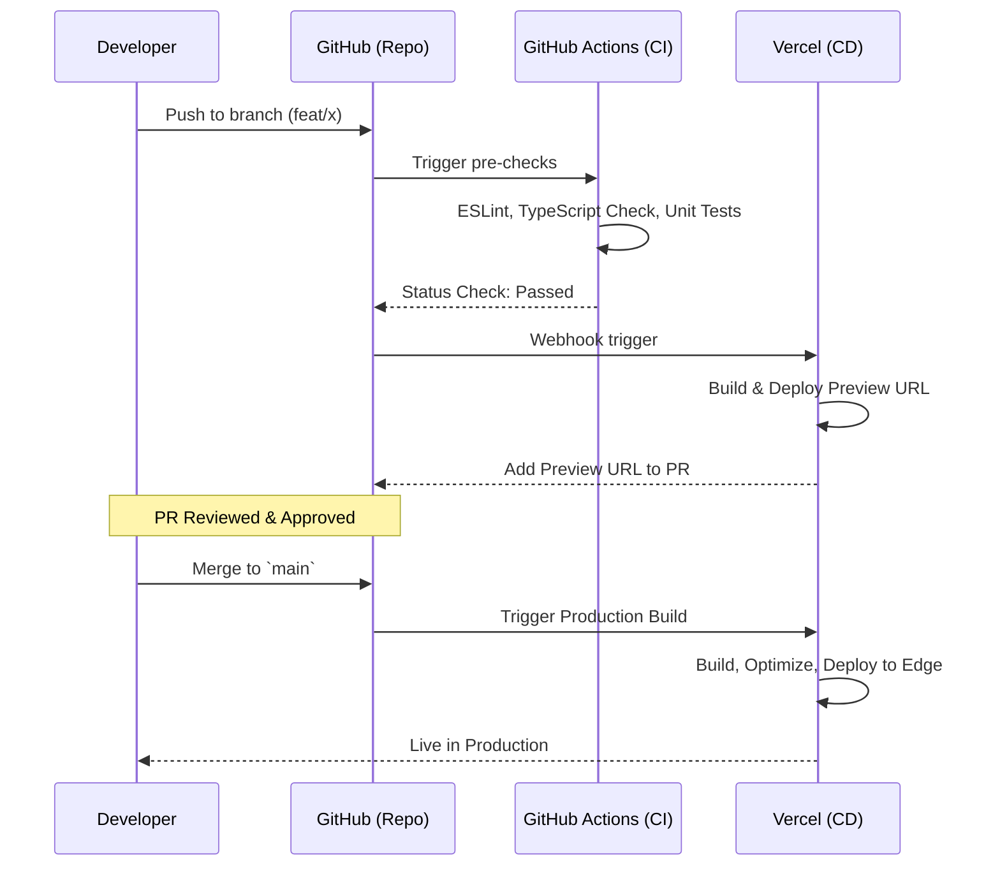

---
# COVER PAGE

**Document ID:** SHNG-DEVOPS-001
**Title:** DevOps & Infrastructure Specification
**Project Name:** Gridless Africa (formerly SolarHub NG)
**Version:** 1.0
**Date:** July 16, 2026
**Status:** Draft for Review
**Author:** Principal DevOps Engineer / SRE Team
**Intended Audience:** DevOps Engineers, Full-Stack Engineers, Security Architects, CTO
**Approval Status:** Pending

---

## Change Log

| Version | Date | Author | Summary of Changes |
| :--- | :--- | :--- | :--- |
| **1.0** | July 16, 2026 | Principal DevOps Engineer | Initial Baseline. Aligned with Technical Architecture v1.0, Backend Spec v1.0, and Security Spec v1.0. |

## Related Documents & Dependencies
* **SHNG-CON-001** Project Constitution v1.0
* **SHNG-ARCH-001** Technical Architecture v1.0
* **SHNG-SEC-001** Security Architecture v1.0
* **SHNG-FE-001** Frontend Technical Specification v1.0
* **SHNG-BE-001** Backend Technical Specification v1.0

## Approval Workflow
1.  **Draft Review:** Cloud Architect & Principal Backend Architect (Pending)
2.  **Security Alignment:** Security Engineer (Pending)
3.  **Final Sign-off:** CTO (Pending)

---

## 1. Executive Summary
The DevOps & Infrastructure Specification (SHNG-DEVOPS-001) defines the deployment, operation, and scaling mechanisms for Gridless Africa. Rather than managing complex, bare-metal Kubernetes clusters, our strategy leverages a fully managed Serverless and Edge ecosystem (Vercel + Supabase). This document outlines how we will maintain 99.9% uptime, deploy continuously with zero downtime, secure our environment variables, and scale effortlessly from MVP to 1 million users while keeping operational overhead and costs minimal.

---

## 2. Infrastructure Overview
Our infrastructure is 100% cloud-native, strictly separating the compute layer (Vercel) from the data layer (Supabase).

* **DNS & CDN:** Managed by Vercel Edge Network. Handles SSL/TLS termination, static asset caching, and global content delivery.
* **Compute (Frontend & API):** Vercel Serverless Functions and Edge Functions running Next.js.
* **Database:** Supabase managed PostgreSQL instance with Supavisor connection pooling.
* **Storage:** Supabase Storage (S3-backed) for user uploads (KYC, Avatars).
* **Third-Party Services:** Paystack (Payments), Resend (Transactional Email), Google Maps (Geolocation API).

### 2.1 Infrastructure Topology Diagram

---

## 3. Environment Strategy
To ensure code quality and prevent production regressions, we utilize a strict 4-tier environment progression.

| Environment | Purpose | Infrastructure | Data Source |
| :--- | :--- | :--- | :--- |
| **Local** | Developer machines. Feature building. | `npm run dev` | Supabase CLI (Local Docker Postgres). |
| **Development** | Ephemeral feature testing. Generated on PR. | Vercel Preview Deployments | Supabase Development Project (Anonymized seed data). |
| **Staging** | Pre-production QA, UAT, and Penetration Testing. | Vercel (`staging` branch) | Supabase Staging Project (Exact replica of Prod schema). |
| **Production** | Live user traffic. | Vercel (`main` branch) | Supabase Production Project (Strict RLS, PITR enabled). |

*Promotion Rule:* Code MUST pass through Staging and receive QA sign-off before a PR can be merged into `main`.

---

## 4. Configuration Management
* **Environment Variables:** Managed exclusively via Vercel's Environment Variable UI. Variables are strictly scoped per environment (Development, Preview, Production).
* **Secret Management:** No secrets (API Keys, JWT Secrets) are ever committed to the Git repository. `.env.local` files are added to `.gitignore`.
* **Prefixing:** Non-sensitive variables exposed to the browser MUST be prefixed with `NEXT_PUBLIC_`. Secure backend secrets remain unprefixed.
* **Rotation Strategy:** Paystack keys and Supabase service-role keys are rotated bi-annually or immediately upon suspected compromise.

---

## 5. CI/CD Strategy
We utilize GitHub Flow augmented with GitHub Actions and Vercel's native deployment pipeline.

### 5.1 CI/CD Pipeline Flow

### 5.2 Rollback Strategy
Vercel's "Instant Rollback" feature is utilized. Because immutable build artifacts are stored for every deployment, reverting to the last known good state takes less than 100ms and requires zero rebuild time.

---

## 6. Infrastructure Security
* **HTTPS/TLS:** TLS 1.3 enforced globally via Vercel Edge. HTTP traffic is permanently redirected to HTTPS.
* **Least Privilege:** * Database connection strings used by Vercel have restricted roles.
    * Developers have `Viewer` access to Production Vercel logs; only DevOps/Founders can access Production Supabase data.
* **WAF (Web Application Firewall):** Vercel Edge Middleware blocks malicious payloads, SQL injection attempts, and enforces rate limiting globally.
* **Audit Trails:** Vercel deployment logs and Supabase administrative action logs are retained for compliance auditing.

---

## 7. Monitoring & Observability
Proactive monitoring ensures we detect issues before customers report them.

* **Uptime Monitoring:** BetterUptime (or similar) pinging the `/api/v1/health` endpoint every 60 seconds from multiple geographic locations.
* **Error Monitoring:** Sentry integrated into Next.js. Triggers PagerDuty alerts for any `5xx` errors occurring more than 5 times in 5 minutes.
* **Application Metrics:** Vercel Speed Insights tracks Core Web Vitals (LCP, FID, CLS) from real user devices.
* **Infrastructure Metrics:** Supabase Dashboard monitored for CPU/RAM utilization, Disk IO, and Connection Pool exhaustion.
* **Logging:** Server Action and API Route logs stream directly from Vercel to Datadog/Axiom for centralized querying and retention.

---

## 8. Backup & Disaster Recovery (DR)

* **Backup Frequency (RPO - 1 Minute):** Supabase Point-in-Time Recovery (PITR) is enabled on the Production instance. We can restore the database to any specific second in the last 7 days.
* **Logical Backups:** A nightly cron job runs `pg_dump` and pushes the encrypted SQL file to a secondary cloud provider (AWS S3) to mitigate extreme vendor-lock/failure of the primary host.
* **Restore Process (RTO - < 4 Hours):**
    1.  Identify corruption timestamp.
    2.  Trigger Supabase PITR restore to a new database instance.
    3.  Update Vercel Production Environment Variables with the new DB connection string.
    4.  Redeploy Vercel `main` branch to flush caches.

---

## 9. Release Management
* **Versioning:** Semantic Versioning (`v1.0.0` = Major.Minor.Patch) via Git tags.
* **Release Cadence:** Continuous Deployment for bug fixes (Patches). Weekly scheduled deployments for new features (Minor).
* **Feature Flags:** Vercel Edge Config (or simple boolean environment variables for MVP) used to hide incomplete features in production, allowing code to merge to `main` safely without exposing the UI.
* **Emergency Hotfix:** Branched directly from `main` (`hotfix/issue-name`), tested locally, merged bypassing standard staging wait times with dual-engineering approval.

---

## 10. Scalability Trajectory

| User Base | Infrastructure Setup | Potential Bottlenecks |
| :--- | :--- | :--- |
| **100 Users** | Standard Vercel + Supabase Free/Pro Tier. | None. |
| **1,000 Users**| Standard setup. Supavisor connection pooling enabled. | Unoptimized DB queries causing slow page loads. |
| **10,000 Users**| Increase Supabase compute instance size (RAM/CPU). Implement aggressive React Server Cache for hardware catalog. | Postgres connection exhaustion during peak traffic. |
| **100,000 Users**| Implement Supabase Read Replicas. Route `GET` requests to replicas, `POST/PATCH` to the primary node. | Paystack API rate limits during bulk transactions. |
| **1 Million+** | Microservices abstraction. Decouple heavy calculations to dedicated background worker clusters. Edge-cached user profiles. | Vercel Serverless execution time limits for complex tasks. |

---

## 11. Cost Optimisation
* **Scale-to-Zero:** Serverless compute means we do not pay for idle EC2 instances at 3 AM.
* **Edge Caching:** Maximizing Next.js Static Site Generation (SSG) and cache headers for the Product Catalog means Vercel serves traffic from the Edge CDN, preventing costly database queries.
* **Log Retention:** Cap Datadog/Axiom log retention at 14 days to prevent ballooning storage costs.

---

## 12. Operational Runbooks (High-Level)

* **Deployment Failure:** * *Symptom:* Vercel build fails.
    * *Action:* Check GitHub Actions logs. Verify TS compilation and ESLint. Fix locally, push new commit. Do NOT override Vercel build commands.
* **Database Connection Failure:** * *Symptom:* Sentry reports `timeout` or `too many clients` errors.
    * *Action:* Verify Supavisor pool size in Supabase. Check if an API route is leaking connections (missing `await`). Increase pool size temporarily if valid traffic spike.
* **Paystack Outage:** * *Symptom:* Webhooks failing, users cannot checkout.
    * *Action:* Toggle feature flag `PAYMENTS_ENABLED=false`. Update UI with banner "Payments temporarily paused for maintenance." Monitor Paystack status page.
* **High 5xx Error Rates:**
    * *Symptom:* PagerDuty alarm triggers.
    * *Action:* Instantly utilize Vercel "Rollback" to previous deployment. Investigate Sentry logs on the reverted commit in a staging environment.

---

## 13. Future Infrastructure (Roadmap Alignment)
* **AI Workloads:** Gemini API calls will be routed through Vercel Edge Functions to utilize streaming (SSE) without hitting Serverless execution timeouts.
* **IoT Devices:** Telemetry data from inverters will NOT route through the Next.js API. We will provision a dedicated Time-Series Database (e.g., TimescaleDB) to ingest high-frequency MQTT data.
* **Multi-Region:** If expanding to East/South Africa, Vercel Edge computing automatically routes users, but Supabase Read Replicas must be provisioned in regional data centers (e.g., AWS af-south-1) to maintain low latency.

---

## 14. Risks & Mitigation

| Risk Category | Specific Risk | Mitigation Plan |
| :--- | :--- | :--- |
| **Infrastructure** | Vercel platform-wide outage. | We rely on Vercel's Enterprise SLA. DNS TTL kept low to allow emergency failover to a backup host (e.g., AWS Amplify) if necessary. |
| **Security** | Accidental commit of `.env` file containing Prod keys. | Utilize `git-secrets` pre-commit hooks. If breached, execute key rotation runbook immediately. |
| **Cost** | DDoS attack causing massive Vercel bandwidth billing. | Vercel WAF enabled. Set strict spend limits/alerts in the Vercel dashboard. |
| **Vendor** | Supabase fundamentally changes pricing/architecture. | Because Supabase is raw PostgreSQL under the hood, we can migrate the database via `pg_dump` to AWS RDS or GCP Cloud SQL with minimal refactoring. |

---

## 15. DevOps Decision Recommendations (DDRs)

### DDR 001: Utilize Vercel Edge Config for MVP Feature Flagging
* **Context:** Section 9 calls for Feature Flags. Standard enterprise tools like LaunchDarkly are powerful but introduce significant cost, network latency, and integration complexity for an MVP.
* **Recommendation:** Use Vercel Edge Config. It propagates key/value pairs (e.g., `{"enable_financing": false}`) globally in under 300ms, integrates natively with Next.js middleware, and is free/low-cost for MVP tier traffic.

---

**Approval Checklist**
- [ ] Infrastructure aligns with the serverless mandate in SHNG-ARCH-001.
- [ ] Environment promotion workflow is strictly defined.
- [ ] Security protocols prevent direct DB access from the internet.
- [ ] Backup (RPO) and Recovery (RTO) targets are established.

*Document Footer: Gridless Africa - DevOps & Infrastructure Spec v1.0*