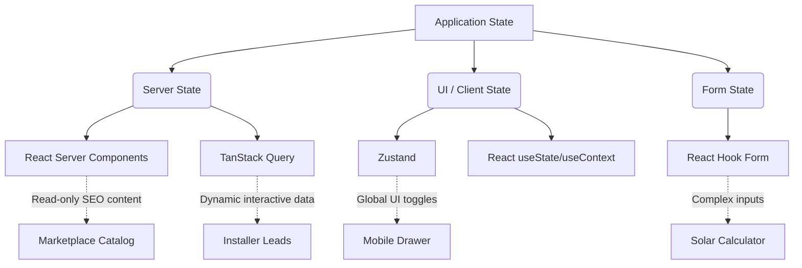

---
# COVER PAGE

**Document ID:** SHNG-FE-001
**Title:** Frontend Technical Specification
**Project Name:** Gridless Africa
**Version:** 1.0
**Date:** July 16, 2026
**Status:** Draft for Review
**Author:** Principal Frontend Architect / UX Engineering Lead
**Intended Audience:** Frontend Engineers, Full-Stack Developers, QA Engineers, DevOps
**Approval Status:** Pending

---

## Change Log

| Version | Date | Author | Summary of Changes |
| :--- | :--- | :--- | :--- |
| **1.0** | July 16, 2026 | Principal Frontend Architect | Initial Baseline. Aligned with Technical Architecture v1.0, UX Strategy v1.0, and Component Library v1.0. |

## Related Documents & Dependencies
* **SHNG-ARCH-001** Technical Architecture v1.0
* **SHNG-API-001** API Specification v1.0
* **SHNG-UX-001** UX Strategy v1.0
* **SHNG-IA-001** Information Architecture v1.0
* **SHNG-DS-001** Design System v1.0
* **SHNG-CL-001** Component Library v1.0

## Approval Workflow
1.  **Draft Review:** React Technical Lead & Accessibility Specialist (Pending)
2.  **Security Alignment:** Security Architect (Pending)
3.  **Final Sign-off:** CTO (Pending)

---

## 1. Executive Summary
The Frontend Technical Specification (SHNG-FE-001) translates the visual and experiential requirements of Gridless Africa into a scalable engineering blueprint. Leveraging the Next.js App Router, React Server Components (RSCs), and Tailwind CSS, this document defines the folder structures, state management paradigms, and data-fetching strategies required to build a performant, accessible, and secure Progressive Web App (PWA). This specification ensures that all frontend developers write predictable, maintainable implementations that strictly adhere to our "Mobile-First" and "Security-First" mandates.

---

## 2. Frontend Goals
* **Performance:** Sub-2.5s First Contentful Paint (FCP) on 3G networks. Heavy utilization of React Server Components to minimize client-side JavaScript bundles.
* **Accessibility:** Strict WCAG 2.2 AA compliance natively integrated into component markup.
* **Responsiveness:** Fluid adaptation from 375px mobile viewports up to 1200px desktop containers using Tailwind utility classes.
* **Maintainability:** Feature-based folder structure to ensure code predictability as the platform scales.
* **Scalability:** Clear separation of client-state and server-state to handle millions of active users.
* **Security:** Prevention of XSS and CSRF through React's native escaping and Next.js Server Actions.
* **SEO:** Server-Side Rendering (SSR) for the Solar Savings Calculator and Public Marketplace to maximize organic acquisition.
* **Progressive Enhancement:** Core functionality (like lead submission) must remain resilient even on slow connections.

---

## 3. Recommended Technology Stack

| Technology | Purpose | Benefits | Trade-offs | Fit for Gridless Africa |
| :--- | :--- | :--- | :--- | :--- |
| **Next.js (App Router)** | Core Framework | Native SSR/SSG, File-system routing, built-in SEO optimizations. | Steep learning curve for RSCs; Vercel lock-in for edge features. | Essential for the SEO-driven Solar Calculator and secure server-side API proxying. |
| **React 18+** | UI Library | Massive ecosystem, declarative UI, concurrent rendering. | Frequent state re-renders if not optimized. | Industry standard; allows sharing logic with future React Native mobile apps. |
| **TypeScript** | Type Safety | Catches runtime errors at compile time; acts as self-documenting code. | Increased initial setup and compilation time. | Mandatory per Constitution to ensure financial and data integrity. |
| **Tailwind CSS** | Styling | Rapid UI development; zero unused CSS in production builds. | Cluttered markup in complex components. | Maps perfectly to our Design Tokens (SHNG-DS-001). |
| **Supabase Client** | BaaS SDK | Seamless integration with our Postgres DB and Auth layer. | Ties frontend tightly to Supabase schemas. | Enables real-time subscriptions and secure RLS querying. |
| **React Hook Form** | Form State | Uncontrolled inputs minimize re-renders on complex forms. | Requires wrapping UI components in `Controller` components. | Ideal for the multi-step Solar Calculator and Quoting Engine. |
| **Zod** | Schema Validation | Schema definition for forms; shared validation between Client and Server. | Slight bundle size increase. | Guarantees data integrity before API submission. |
| **TanStack Query** | Client Server-State | Caching, deduplication, and background fetching for client components. | Overkill for simple static pages. | Perfect for dynamic dashboards (Installer Leads, Admin tables) needing optimistic updates. |
| **Zustand** | Global UI State | Lightweight, boilerplate-free state management. | Lacks the strict architectural rails of Redux. | Ideal for managing non-server state (e.g., Mobile Drawer open/close, multi-step UI flow). |
| **Framer Motion** | Animation | Fluid page transitions and layout animations. | Adds to JS bundle size. | Used minimally for critical UX feedback (e.g., Escrow Success animation). |

---

## 4. Frontend Architecture

### 4.1 Folder Structure (Feature-Based)
We employ a fractal, feature-based architecture within the Next.js `src/` directory to colocate related logic.

```text
src/
├── app/                  # Next.js App Router (Pages, Layouts, Routing)
│   ├── (public)/         # Route Group: Marketing, Calculator
│   ├── (customer)/       # Route Group: Customer Dashboard
│   ├── (installer)/      # Route Group: Installer Portal
│   ├── (admin)/          # Route Group: Admin Command Center
│   └── api/              # Route Handlers
├── components/           # Shared UI Library (Buttons, Cards, Inputs)
├── features/             # Feature-specific logic
│   ├── calculator/       # Calculator components, stores, hooks
│   ├── quotes/           # Quoting engine components, API layers
│   └── payments/         # Escrow UI, Paystack integrations
├── lib/                  # Shared utilities (Supabase client, Zod schemas, formatting)
├── stores/               # Zustand global UI stores
└── types/                # Global TypeScript definitions
```

### 4.2 Layout & Boundary Architecture
* **Layouts (`layout.tsx`):** Used to persist navigational UI (Sidebars, Bottom Tabs) across route changes without re-rendering.
* **Error Boundaries (`error.tsx`):** Placed at the root of each route group to catch rendering errors and display a fallback UI, preventing full app crashes.
* **Loading Boundaries (`loading.tsx`):** Wraps Server Components in React Suspense, displaying standard Skeleton Loaders from the Component Library while data resolves.

---

## 5. Routing Strategy

### 5.1 Route Groups and Access
* **`(public)`:** `/`, `/calculator`, `/marketplace`, `/login`. Publicly accessible. Heavily cached via Next.js static rendering.
* **`(customer)`:** `/dashboard`, `/projects`. Protected. Requires `customer` role claim.
* **`(installer)`:** `/installer-dashboard`, `/leads`. Protected. Requires `installer` role claim.
* **`(admin)`:** `/admin/kyc`. Protected. Requires `admin` role and strict MFA validation.

### 5.2 Middleware Route Guards
Next.js `middleware.ts` intercepts all requests. It verifies the Supabase JWT session cookie. If a user attempts to access a protected route without a valid session, they are 302 redirected to `/login?redirectTo=[intended_path]`. Role-based routing is enforced here to prevent an Installer from accessing Customer routes.

### 5.3 404 and Error Pages
* `not-found.tsx`: Renders the branded empty state defined in SHNG-WF-001.
* `global-error.tsx`: Catch-all for fatal application errors, offering a "Hard Refresh" recovery action.

---

## 6. State Management Strategy



* **Server State (RSC):** Default for read-only data. Data is fetched on the server and passed to client components as static props.
* **Server State (TanStack Query):** Used inside Client Components for highly dynamic, mutable data (e.g., Installer Kanban boards) that requires background refetching, caching, and optimistic UI updates.
* **Global UI State (Zustand):** Used for transient state spanning multiple disconnected components (e.g., storing the ongoing steps of the Solar Calculator before final submission, managing toast notification queues).
* **Form State (React Hook Form):** Tracks dirty states, touched fields, and validation logic locally within the form component.

---

## 7. API Integration Strategy
* **Server Actions:** Preferred method for mutations (Create, Update, Delete). Example: `submitQuoteAction(formData)`. Ensures business logic runs securely on the server and automatically invalidates the Router Cache.
* **API Layer Architecture:** All external API calls (Paystack, Google Maps) are abstracted into functions within `src/lib/api/` to ensure the UI components remain decoupled from the network implementation.
* **Optimistic Updates:** When an Installer moves a job card to "Completed", TanStack Query will immediately update the local cache to reflect the UI change, reverting only if the server returns an error.

---

## 8. Authentication Implementation
* **Supabase Auth Helpers:** Utilizing `@supabase/ssr` to manage cookies securely across Server Components, Server Actions, and Route Handlers.
* **Login Flow:** Client submits credentials -> Server Action calls `supabase.auth.signInWithPassword` -> Sets HTTP-only cookie -> Redirects to role-specific dashboard.
* **Protected Pages:** Server Components inherently protect data by checking `supabase.auth.getUser()` before rendering.
* **Future Web3:** The `login.tsx` view reserves a component slot for `Web3Connect`. This will trigger a wallet signature request, converting the signed nonce into a custom Supabase JWT.

---

## 9. Component Architecture
Adhering to SHNG-CL-001, we implement a modified Atomic Design structure:
* **UI Primitives (`src/components/ui`):** Buttons, Inputs, Cards. Highly reusable, strictly styled via Tailwind variant configurations (e.g., `cva` - Class Variance Authority).
* **Shared Components (`src/components/shared`):** Navbar, Footers, complex tables used across multiple roles.
* **Feature Components (`src/features/...`):** Highly specific components tied to business logic. For example, `QuoteComparisonMatrix` belongs in `src/features/quotes`, as it is not reusable outside of that specific context.

---

## 10. Forms & Validation
* **Architecture:** Every form utilizes `<form action={serverAction}>` (or `onSubmit` for client-heavy logic), wrapped with React Hook Form.
* **Validation Flow:** 1. Define Zod Schema (`QuoteSchema`).
    2. Pass schema to RHF via `@hookform/resolvers/zod` for immediate client-side validation.
    3. Export the identical Zod schema to the Server Action to re-validate the payload securely on the backend.
* **Error Presentation:** RHF `errors` object maps to the specific `<Input />` component, triggering the red error border and injecting the semantic error message below the field.

---

## 11. Responsive Strategy
* **Tailwind Breakpoints:** We strictly use Tailwind's default breakpoints: `sm` (640px), `md` (768px), `lg` (1024px).
* **Mobile-First Implementation:** Base utility classes style the mobile view. Breakpoint prefixes overwrite them for larger screens.
    * *Example:* `<div className="flex flex-col md:flex-row">` (Stacks vertically on mobile, horizontally on tablet/desktop).
* **Dashboards:** Use CSS Grid for robust reflowing. `<div className="grid grid-cols-1 md:grid-cols-2 lg:grid-cols-4">` for KPI cards.

---

## 12. Accessibility (A11y) Implementation
* **Radix UI:** We will use Radix UI primitives as the accessible, unstyled foundation for complex components (Dialogs, Selects, Accordions), styling them with Tailwind. This guarantees focus trapping and keyboard support.
* **Focus Management:** Tailwind `focus-visible:ring-2 focus-visible:ring-primary` ensures keyboard users see a clear focus indicator, without penalizing mouse users with ugly outlines.
* **Semantic HTML:** Strict enforcement of `<main>`, `<nav>`, `<aside>`, `<article>`, and correct heading hierarchies (`<h1>` down to `<h6>`).

---

## 13. Performance Optimisation
* **Image Optimisation:** All hardware and avatar images must use `next/image` with `sizes` attributes defined to generate appropriate src-sets, preventing massive image downloads on mobile.
* **Font Loading:** `next/font/google` used to host fonts locally at build time, eliminating external render-blocking network requests and preventing Cumulative Layout Shift (CLS).
* **Bundle Optimisation:** Client Components (`"use client"`) are pushed as far down the component tree as possible. Layouts and heavy data-fetching wrappers remain Server Components.
* **Suspense Boundaries:** Implement `<Suspense fallback={<Skeleton />}>` around slow database queries to allow the rest of the page to stream to the user instantly.

---

## 14. Error Handling
* **Network/API Errors:** Caught by TanStack Query or Server Action try/catch blocks. Trigger a standardized Toast notification component via Zustand.
* **Validation Errors:** Handled locally by React Hook Form.
* **Unexpected Exceptions:** Caught by Next.js `error.tsx` boundary. Renders a user-friendly "Something went wrong" component with a `reset()` function to attempt a re-render.

---

## 15. Frontend Security
* **XSS Prevention:** React natively escapes all variables embedded in JSX. `dangerouslySetInnerHTML` is strictly forbidden unless rendering explicitly sanitized Markdown (e.g., Blog content) parsed through DOMPurify.
* **CSRF:** Next.js Server Actions automatically include origin checking and CSRF protection.
* **File Uploads:** Client-side validation of MIME types and file sizes before requesting a signed Supabase Storage URL. Never upload directly through the Next.js API limits.

---

## 16. Analytics & Monitoring
* **Web Vitals:** `@vercel/speed-insights` injected at the root layout to track real-world LCP, FID, and CLS scores.
* **Error Tracking:** Sentry script injected to catch client-side React rendering errors and unhandled promise rejections.
* **Funnel Analysis:** A custom `useAnalytics` hook wraps plausible/GA4 to trigger events on key milestones (e.g., `trackEvent('calculator_completed')`).

---

## 17. Internationalisation & Localisation (i18n)
* **Setup:** Next.js `app/[locale]/` folder structure implemented from Day 1 to prevent massive refactoring later. Default locale is `en-NG`.
* **Currency Formatting:** All financial data (Quotes, Escrow) is passed through a global utility function `formatCurrency(amount, 'NGN')` utilizing `Intl.NumberFormat`.

---

## 18. Future Frontend Evolution
* **AI Consultant:** Designed as a distinct Server-Sent Events (SSE) component utilizing the `ai` (Vercel AI SDK) package for seamless streaming UI without blocking the main thread.
* **Mobile Apps:** UI logic is decoupled into custom hooks (e.g., `useQuoteData()`) allowing easy porting to React Native/Expo in Phase 3.

---

## 19. Frontend Risks & Mitigation

| Risk | Description | Mitigation Strategy |
| :--- | :--- | :--- |
| **Hydration Mismatches** | Discrepancies between Server rendering and Client hydration causing errors. | Ensure browser extensions do not manipulate DOM during dev. Avoid using `window` or `localStorage` directly in component render paths without `useEffect`. |
| **Over-fetching** | RSCs fetching data that child components don't need, wasting DB resources. | Utilize React's `cache()` function. Colocate data fetching inside the specific component that needs it; Next.js will deduplicate the requests. |
| **Prop Drilling** | Passing state through 5+ layers of components. | Rely on Context API or Zustand for deeply nested state (like the multi-step calculator). |

---

## 20. Frontend Decision Recommendations (FDRs)

### FDR 001: Adopt `cva` (Class Variance Authority) for Component Styling
* **Context:** Tailwind CSS strings can become incredibly long and difficult to read when dealing with complex component states (primary, secondary, disabled, sizes).
* **Recommendation:** Use the `cva` package alongside `tailwind-merge` and `clsx` in our UI primitive library. This allows engineers to define clean variants (`<Button variant="destructive" size="lg" />`) and mathematically guarantees that conflicting Tailwind classes (e.g., `bg-blue-500` and `bg-red-500`) are resolved correctly based on the component's state.

---

**Approval Checklist**
- [ ] RSC vs Client Component boundaries are clearly defined.
- [ ] State management strategy matches application complexity.
- [ ] Forms leverage shared Zod schemas for client/server validation.
- [ ] Mobile-first Tailwind implementation is mandated.

*Document Footer: Gridless Africa - Frontend Technical Specification v1.0*