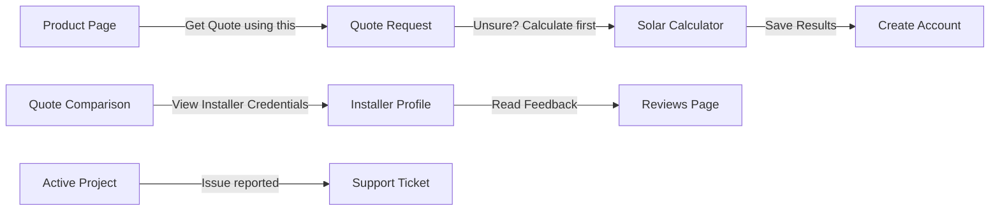

---
# COVER PAGE

**Document ID:** SHNG-IA-001
**Title:** Information Architecture
**Project Name:** Gridless Africa (formerly SolarHub NG)
**Version:** 1.0
**Date:** July 16, 2026
**Status:** Draft for Review
**Author:** Principal UX Architect / Information Architecture Team
**Intended Audience:** Product Designers, Frontend Engineers, Product Managers, Content Strategists
**Approval Status:** Pending

---

## Change Log

| Version | Date | Author | Summary of Changes |
| :--- | :--- | :--- | :--- |
| **1.0** | July 16, 2026 | Principal UX Architect | Initial Baseline. Aligned with Constitution v1.0, PRD v1.0, and UX Strategy v1.0. |

## Related Documents & Dependencies
* **Project Constitution v1.0** (SH-NG-CONST-001)
* **Product Requirements Document v1.0** (SH-NG-PRD-001)
* **Technical Architecture v1.0** (SHNG-ARCH-001)
* **UX Strategy v1.0** (SHNG-UX-001)

## Approval Workflow
1.  **Draft Review:** Lead Product Designer & Frontend Lead (Pending)
2.  **Product Alignment:** Head of Product (Pending)
3.  **Final Sign-off:** CTO / Co-Founders (Pending)

---

## 1. Executive Summary
The Information Architecture (IA) for Gridless Africa maps the structural blueprint of the platform. It translates our complex ecosystem—connecting consumers, verified installers, and OEM vendors—into an intuitive, scalable digital environment. By logically organizing content, optimizing search, and establishing clear navigational pathways, this IA supports our product vision of building trust and simplifying the transition to renewable energy across Nigeria.

## 2. IA Principles
*   **Simplicity:** Reduce cognitive load by presenting only the information necessary for the current step in the user journey.
*   **Scalability:** The architecture must seamlessly accommodate future verticals (e.g., IoT monitoring, AI, Financing) without requiring a ground-up navigation redesign.
*   **Discoverability:** Core tools, specifically the Solar Savings Calculator and the Equipment Marketplace, must be accessible from any entry point within 2 clicks.
*   **Consistency:** Predictable navigation patterns across Public, Customer, Installer, and Admin portals.
*   **Mobile-First Navigation:** Optimized for thumb-reachability, utilizing bottom tab bars for authenticated mobile users and hidden drawer menus for public mobile views.
*   **Accessibility:** Semantic HTML structures, clear focus states, and ARIA-compliant wayfinding.
*   **Progressive Disclosure:** Mask complexity. For example, reveal advanced battery specs only if the user expands the details section.
*   **Search-First Where Appropriate:** The equipment catalog relies heavily on robust search and filtering rather than deep, nested category trees.

---

## 3. Site Map

```mermaid
graph TD
    Root((Gridless Africa))
    
    %% Public Nodes
    Root --> Public[Public Site]
    Public --> Home[Home]
    Public --> Calc[Solar Savings Calculator]
    Public --> Mkt[Marketplace & Products]
    Public --> InstDir[Installer Directory]
    Public --> Content[Blog / FAQ / Legal]
    Public --> Auth[Login / Register]

    %% Customer Nodes
    Root --> Customer[Customer Portal]
    Customer --> CDash[Dashboard]
    Customer --> CQuotes[Quote Management]
    Customer --> CProj[Active Projects & Escrow]
    Customer --> CMaint[Maintenance & Warranties]
    Customer --> CSaved[Saved Items & Profile]

    %% Installer Nodes
    Root --> Installer[Installer Portal]
    Installer --> IDash[Dashboard & Earnings]
    Installer --> ILeads[Lead Inbox]
    Installer --> IQuotes[Submitted Quotes]
    Installer --> IJobs[Active Jobs & Calendar]
    Installer --> IProfile[Company Profile & KYC]

    %% Admin Nodes
    Root --> Admin[Admin Portal]
    Admin --> ADash[Command Center]
    Admin --> AUsers[User & KYC Management]
    Admin --> AMkt[Marketplace Moderation]
    Admin --> AEscrow[Payment & Escrow Logs]
    Admin --> ASystem[System Settings]
```

---

## 4. Public Website Structure

| Page | Purpose | Audience | Main Content | CTAs | Related Pages |
| :--- | :--- | :--- | :--- | :--- | :--- |
| **Home** | Value proposition & entry point. | Guests | Hero banner, How it Works, Trust signals, Featured Installers. | `Calculate Savings`, `Find an Installer` | Calculator, Register |
| **Marketplace** | Hub for hardware discovery. | Guests, Customers | Top categories (Inverters, Panels, Batteries), Featured brands. | `View All Products` | Product Details |
| **Product Details** | Specific hardware specs and compatibility. | Guests, Customers | Image gallery, Technical specs, Compatibility, Vendor verification. | `Save Product`, `Get Quote with this` | Quote Request |
| **Installers** | Public directory of verified professionals. | Guests, Customers | List of installers, Regional filters (e.g., Lagos, Oyo/Akobo). | `View Profile` | Installer Profile |
| **Installer Profile** | Showcases an installer's credibility. | Guests, Customers | Bio, KYC badge, Completed projects, Customer reviews. | `Request Quote` | Quote Request |
| **Calculator** | Flagship acquisition tool. | Guests | Multi-step form (Appliances, Fuel spend), ROI visualization. | `Get Verified Quotes` | Register, Quote Request |
| **FAQ** | Education and objection handling. | All | Categorized questions (Payments, Escrow, Warranties). | `Contact Support` | Contact |
| **Legal** | Compliance. | All | Privacy Policy, Terms of Service, NDPR notices. | None | Home |

---

## 5. Customer Portal Structure

| Page | Features & Content | Navigation & Permissions | Related APIs | Database Entities |
| :--- | :--- | :--- | :--- | :--- |
| **Dashboard** | System health score, active quote alerts, next steps. | Bottom Tab (Mobile) / Sidebar (Desktop) | `GET /users/me`, `GET /projects` | `profiles`, `projects` |
| **Quote Requests** | List of pending leads sent to the marketplace. | Tab: "Quotes" | `GET /quote-requests` | `quote_requests` |
| **Quote Compare** | Side-by-side 3-bid matrix, ROI breakdown. | Sub-page of Requests | `GET /quotes` | `quotes`, `quote_line_items` |
| **Active Projects** | Kanban-style milestone tracker, Escrow status. | Tab: "Projects" | `GET /projects/{id}` | `projects`, `installations` |
| **Payments** | Escrow deposit UI, transaction history, receipts. | Sub-page of Projects | `POST /payments/initialize`| `payments` |
| **Maintenance** | Service booking, warranty document storage. | Tab: "Maintenance" | `GET /warranties` | `warranties` (Future) |
| **Saved Items** | Bookmarked products and preferred installers. | Sidebar / Profile Menu | `GET /users/saved` | `saved_items` |
| **Profile & Settings**| Contact info, address management, password reset. | Header Menu (Avatar) | `PATCH /users/me` | `profiles`, `auth.users` |

---

## 6. Installer Portal Structure

| Page | Features & Content | Navigation & Permissions | Related APIs | Database Entities |
| :--- | :--- | :--- | :--- | :--- |
| **Dashboard** | Revenue pipeline, profile view count, rating summary. | Sidebar (Desktop-focused) | `GET /installers/stats` | `installer_profiles` |
| **Leads** | Geofenced inbox of available quote requests. | Sidebar: "Leads" | `GET /quote-requests` | `quote_requests` |
| **Quotes** | Active bids, won/lost tracking, quoting engine form. | Sidebar: "My Quotes" | `POST /quotes` | `quotes` |
| **Jobs** | Active installations, milestone sign-offs. | Sidebar: "Jobs" | `PATCH /projects/{id}` | `projects`, `installations` |
| **Calendar** | Timeline of site visits and installation dates. | Tab inside Jobs | `GET /installers/schedule`| `installations` |
| **Reviews** | Customer feedback and reply interface. | Sidebar: "Reviews" | `GET /reviews` | `reviews` |
| **Earnings** | Escrow payout history, pending clearances. | Sidebar: "Earnings" | `GET /payments/payouts`| `payments` |
| **Company Profile** | KYC upload wizard, CAC documents, public bio. | Sidebar: "Profile" | `POST /installers/kyc` | `kyc_documents` |

---

## 7. Admin Portal Structure

| Page | Features & Content | Administrative Permissions | Related APIs |
| :--- | :--- | :--- | :--- |
| **Command Center** | High-level GMV metrics, urgent alerts (KYC pending). | Requires `admin` Role | `GET /admin/stats` |
| **User Mgmt** | List of all users, suspension controls, impersonation. | Requires `admin` Role | `GET /admin/users` |
| **Installer KYC** | Document viewer, Approve/Reject workflow toggles. | Requires `admin` Role | `PATCH /admin/kyc/{id}` |
| **Marketplace** | Hardware catalog moderation, vendor approval. | Requires `admin` Role | `POST /admin/products` |
| **Quotes & Escrow**| Manual oversight of stalled projects, dispute flagging. | Requires `admin` Role | `GET /admin/projects` |
| **Audit Logs** | Immutable timeline of critical platform actions. | Super-Admin Only | `GET /admin/audit` |
| **Settings** | Global variable controls (e.g., platform take-rate). | Super-Admin Only | `PATCH /admin/settings`|

---

## 8. Navigation Architecture

*   **Primary Navigation (Desktop):** Persistent top navigation bar for public pages (Home, Calculator, Marketplace, Sign In).
*   **Secondary Navigation (Sidebars):** Used exclusively in authenticated portals (Customer, Installer, Admin) to handle deep, complex feature sets.
*   **Mobile Navigation:** 
    *   *Public:* Hamburger menu revealing a full-screen overlay.
    *   *Authenticated:* Fixed Bottom Tab Bar containing 4-5 core destinations (e.g., Home, Quotes, Projects, Profile) to maximize thumb reachability.
*   **Breadcrumbs:** Essential for the hardware marketplace (e.g., `Home > Marketplace > Inverters > Sunsynk 5kVa`) and Admin portals to prevent lost states.
*   **Contextual Navigation:** In-line links providing logical next steps (e.g., linking directly from an accepted quote to the "Fund Escrow" screen).

---

## 9. Search Architecture

*   **Global Search (Public):** Prominently placed in the top navigation. Auto-suggests equipment brands and installer names.
*   **Marketplace Search:** Trigram-indexed search focusing on hardware specs. Includes visual autocomplete displaying product thumbnails.
*   **Search Filters:** 
    *   *Products:* Brand, Capacity (kVa), Price Range, Compatibility.
    *   *Installers:* Region (e.g., Oyo, Lagos), Rating, Verification Status.
*   **Admin Search:** Highly tolerant search allowing lookup by User ID, Email, Phone Number, or Paystack Reference ID across the entire database.

---

## 10. Content Hierarchy

Every major page follows a strict "F-Pattern" visual hierarchy:
1.  **Headline:** Clear, jargon-free statement of the page's purpose (e.g., "Your Solar Savings Estimate").
2.  **Key Metrics:** High-contrast data points (e.g., "Estimated ROI: 18 Months").
3.  **Primary CTA:** The single most important action (e.g., "Request Bids from Installers").
4.  **Supporting Information:** Secondary data, spec tables, or detailed breakdowns.
5.  **Trust Signals:** Escrow badges, "Verified by Gridless" checkmarks, and secure payment icons placed near transaction points.

---

## 11. Cross-Linking Strategy

---

## 12. URL Structure

URLs adhere strictly to `lowercase-kebab-case` and prioritize SEO and clean routing (Next.js App Router conventions).

*   **Public:**
    *   `/calculator`
    *   `/marketplace`
    *   `/marketplace/inverters`
    *   `/marketplace/products/[product-slug]`
    *   `/installers`
    *   `/installers/[installer-slug]`
*   **Authenticated (Customer):**
    *   `/dashboard`
    *   `/dashboard/quotes`
    *   `/dashboard/quotes/[quote-id]`
    *   `/dashboard/projects/[project-id]`
*   **Authenticated (Installer):**
    *   `/installer/dashboard`
    *   `/installer/leads`
    *   `/installer/jobs/[job-id]`
*   **Admin:**
    *   `/admin/dashboard`
    *   `/admin/kyc-reviews`

---

## 13. Future Expansion Placeholder

The IA is designed with intentional "empty slots" to accommodate future roadmaps without breaking current navigation:
*   **AI Energy Consultant:** Will integrate as a global Floating Action Button (FAB) across all authenticated pages, opening a contextual side-drawer rather than requiring a dedicated URL.
*   **Financing Portal:** Will branch off the `Quote Comparison` flow as an alternative to "Fund via Escrow."
*   **Binance Wallet:** Will integrate seamlessly into the `/settings/security` tab and the `/auth` login screen.
*   **IoT Monitoring:** Will live under a new `/dashboard/telemetry` route, becoming the primary dashboard view post-installation.

---

## 14. Accessibility Considerations

*   **Semantic HTML:** Strict use of `<nav>`, `<main>`, `<aside>`, and `<header>` tags to ensure screen readers parse the IA correctly.
*   **Skip Navigation:** A visually hidden "Skip to main content" link at the top of the DOM for keyboard users.
*   **ARIA Landmarks:** Role definitions applied to complex comparison tables and the quoting engine.

---

## 15. IA Risks & Mitigation

| Risk | Description | Mitigation Strategy |
| :--- | :--- | :--- |
| **Navigation Complexity** | Mixing B2B (Installer) and B2C (Customer) navigation items, confusing users. | Strict routing separation. A user role determines the layout wrapper they receive. Installers and Customers never share the same dashboard URLs. |
| **Orphaned Products** | Deeply categorized hardware items becoming difficult to find. | Flatten the taxonomy. Rely on faceted search/filtering (Brand, Capacity) rather than deep folder trees (Category > Subcategory > Item). |
| **Mobile Table Scrolling** | Quote comparison matrix breaking mobile viewports. | Pivot the IA for mobile: display quotes as stacked, collapsible cards rather than a horizontal scrolling table. |

---

## 16. Information Architecture Recommendations (IARs)

### IAR 001: Installer "Calendar" & "Earnings" Scope Definition
*   **Context:** Standard SaaS dashboards often include robust Calendar and Earnings features (as outlined in Section 6). However, the PRD v1.0 strictly scopes the MVP to the Lead-to-Quote pipeline and Escrow.
*   **Recommendation:** To maintain IA consistency for the future while respecting MVP bounds, the `/installer/calendar` and `/installer/earnings` navigation items should be visually present but simplified. "Calendar" will act as a simple date-list of upcoming jobs, and "Earnings" will act as a read-only ledger of Escrow payouts, deferring complex scheduling/analytics tools to Phase 2.

---

**Approval Checklist**
- [ ] Sitemap reflects all requirements from PRD v1.0.
- [ ] Mobile-first navigation structures are explicitly defined.
- [ ] URLs follow strict kebab-case and SEO best practices.
- [ ] Future expansion verticals are accommodated seamlessly.

*Document Footer: Gridless Africa - Information Architecture v1.0*