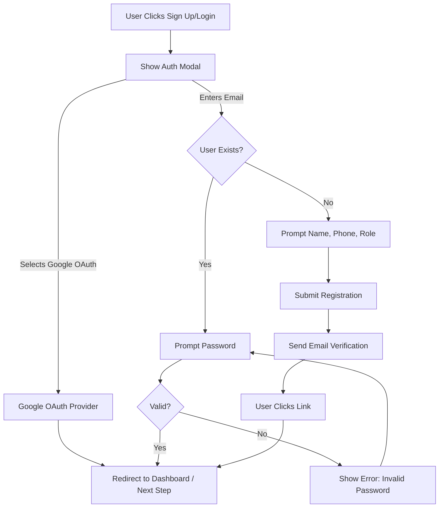
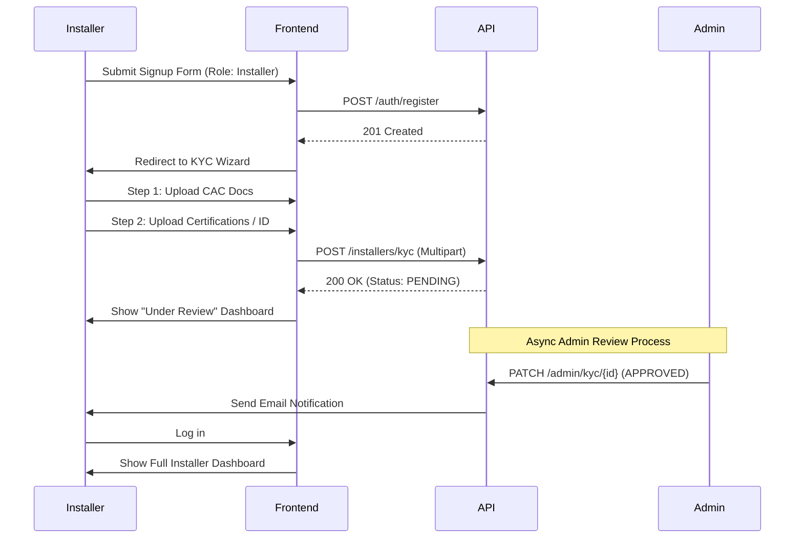

---
# COVER PAGE

**Document ID:** SHNG-UF-001
**Title:** User Flows
**Project Name:** Gridless Africa (formerly SolarHub NG)
**Version:** 1.0
**Date:** July 16, 2026
**Status:** Draft for Review
**Author:** Principal UX Designer / Service Design Team
**Intended Audience:** Product Designers, Frontend Engineers, QA Engineers, Product Managers
**Approval Status:** Pending

---

## Change Log

| Version | Date | Author | Summary of Changes |
| :--- | :--- | :--- | :--- |
| **1.0** | July 16, 2026 | Principal UX Designer | Initial Baseline. Aligned with PRD v1.0, Technical Architecture v1.0, and UX Strategy v1.0. |

## Related Documents & Dependencies
* **SHNG-CON-001** Project Constitution v1.0
* **SHNG-PRD-001** Product Requirements Document v1.0
* **SHNG-ARCH-001** Technical Architecture v1.0
* **SHNG-API-001** API Specification v1.0
* **SHNG-IA-001** Information Architecture v1.0

## Approval Workflow
1.  **Draft Review:** Lead Product Designer & Frontend Lead (Pending)
2.  **Product Alignment:** Head of Product (Pending)
3.  **Final Sign-off:** CTO / Co-Founders (Pending)

---

## 1. Executive Summary
The User Flows documentation (SHNG-UF-001) maps the step-by-step journeys users take to achieve their goals on Gridless Africa. While Information Architecture dictates *where* things live, User Flows dictate *how* users navigate between them. This document provides engineering, QA, and design teams with exact behavioral blueprints—covering main success paths, alternate routes, and error recovery—ensuring a frictionless, mobile-first experience that aligns with our core mission of building trust.

---

## 2. User Personas Covered

| Persona | Goals | Permissions |
| :--- | :--- | :--- |
| **Guest Visitor** | Learn about solar, browse marketplace, calculate estimated costs & ROI. | Public read-only access, Calculator execution. |
| **Customer** | Request quotes, compare bids, fund escrow, track installation, book maintenance. | Full access to own profile, quote requests, and active projects. |
| **Installer** | Build credibility, receive qualified leads, submit quotes, manage active jobs, receive payouts. | View matched leads, submit quotes (if KYC verified), manage own jobs. |
| **Administrator** | Moderate the marketplace, verify installers, resolve disputes, monitor platform GMV. | Global read/write access (Admin), KYC approval, dispute resolution. |

---

## 3. User Flow Principles
*   **Minimal Friction:** Only ask for data when absolutely necessary (Progressive Disclosure).
*   **Clear Decision Points:** Limit primary calls-to-action (CTAs) to one per screen.
*   **Error Recovery:** Never leave a user at a dead end. Always provide a way back or a corrective action.
*   **Mobile-First Interactions:** Design flows for thumb reachability, intermittent network connections, and smaller viewports typical of our primary target audience.
*   **Accessibility:** Support keyboard navigation, screen reader feedback, and high-contrast focus states.
*   **Security Checkpoints:** Re-authenticate users for destructive or high-value actions (e.g., initiating escrow refund).
*   **Trust-Building Moments:** Inject reassuring copy and visual badges right before high-anxiety actions (e.g., payments).

---

## 4. Authentication Flows

### 4.1 Sign Up / Login (Unified Flow)

*   **Alternate Paths:** Forgot password leads to Magic Link / Password Reset flow.
*   **Session Expiry:** Middleware detects expired JWT -> Renders localized modal "Session expired, please log in again" -> Retains current route state -> User logs in -> Modal closes, action resumes.
*   **Future Binance Wallet (Phase 3):** Modal will include "Connect Wallet". Flow bypasses email/password entirely.

---

## 5. Customer Flows

### 5.1 Solar Savings Calculator to Quote Request (Flagship Flow)

*   **Goal:** Convert a curious visitor into an actionable lead.
*   **Preconditions:** None (Guest state).
*   **Trigger:** Clicks "Calculate Savings" on Home or Marketplace.
*   **Main Success Path:**
    1.  User lands on Step 1: Property Type (Residential/Commercial). Selects option.
    2.  Step 2: Appliances. User adds ACs, TVs, Fridges using +/- counters. Clicks Next.
    3.  Step 3: Usage. Inputs hours of daily grid outage and current fuel spend (₦). Clicks Next.
    4.  Step 4: Location. Selects State/LGA (e.g., Oyo / Akobo).
    5.  Step 5: Results generation. Loading spinner shown.
    6.  System displays required kVa, estimated battery kWh, and ROI snapshot.
    7.  User clicks "Get Verified Quotes".
    8.  System prompts Auth (Login/Signup). User completes Auth.
    9.  System converts Calculator Result into a `quote_request`.
    10. User redirected to Customer Dashboard showing "Request Sent to Installers".
*   **Alternate Paths:** User clicks "Save for Later" -> Prompts Auth -> Saves to profile without submitting as an active lead.
*   **Error Paths:** Network failure during calculation -> Show "Calculation failed. Retry" toast -> Retain input state.
*   **Related Pages:** `/calculator`, `/dashboard/quotes`
*   **Related APIs:** `POST /api/v1/calculator/calculate`, `POST /api/v1/quote-requests`
*   **Related DB Entities:** `quote_requests`, `profiles`

### 5.2 Quote Comparison & Selection

*   **Goal:** Select an installer from up to 3 bids.
*   **Preconditions:** User has an active `quote_request` with at least 1 bid.
*   **Trigger:** User receives notification "New quote received", clicks link.
*   **Main Success Path:**
    1.  User opens Dashboard > Quotes > Views specific request.
    2.  Screen displays a 3-column matrix comparing Installer A, B, and C (Total Cost, Hardware, Labor, Rating).
    3.  User taps "View Details" on Installer B to see full line items and warranty terms.
    4.  User clicks "Accept Quote".
    5.  Confirmation Modal: "Are you sure? This will lock in the price and decline other bids."
    6.  User clicks "Confirm".
    7.  System updates quote status, generates a `project`, and redirects to Payment Initialization.
*   **Related APIs:** `PATCH /api/v1/quotes/{id}/accept`

### 5.3 Marketplace Browsing & Saving

*   **Goal:** Discover and save specific hardware.
*   **Main Success Path:** Home > Marketplace > Selects Category (Inverters) > Uses drawer filters (Brand: Sunsynk, Phase: Single) > Clicks Product Card > Clicks "Save Product".
*   **Error Paths:** Zero search results -> Show Empty State "No products match your filters" with a "Clear Filters" button.

*(Note: Maintenance, Financing, AI Assistant are reserved for Phase 2/3).*

---

## 6. Installer Flows

### 6.1 Registration & KYC Verification

*   **Error Paths:** File size exceeds 5MB -> Inline error on upload step. Admin rejects KYC -> Dashboard shows "Action Required" with rejection reason and "Re-submit" button.

### 6.2 Submitting a Quote

*   **Goal:** Bid on a customer lead.
*   **Preconditions:** Status = `KYC_VERIFIED`. Lead status = `OPEN`. Bid count < 3.
*   **Trigger:** Installer clicks "Quote this Lead" from Inbox.
*   **Main Success Path:**
    1.  User reviews customer's calculator output and location.
    2.  User adds Line Items (searches catalog, inputs quantity, inputs unit price).
    3.  User inputs Labor Cost and Warranty Months.
    4.  System auto-calculates Total Amount.
    5.  User clicks "Submit Quote".
    6.  Redirects to Dashboard > "My Quotes" with status `PENDING_CUSTOMER_REVIEW`.
*   **Error Paths:** 3rd bid submitted by another installer milliseconds before -> API returns 409 Conflict -> Show modal "This lead has reached maximum bids."

---

## 7. Administrator Flows

### 7.1 KYC Approval Flow
*   **Goal:** Vet a new installer to maintain platform trust.
*   **Preconditions:** Admin is logged in.
*   **Main Success Path:** Dashboard > Clicks "Pending KYC (5)" alert > Views Installer Profile > Opens CAC Document in secure viewer > Verifies details match > Clicks "Approve" > System updates status and emails Installer.
*   **Alternate Path:** Clicks "Reject" -> Opens text area to provide reason -> Submits -> System updates status to `REJECTED_NEEDS_INFO`.

---

## 8. Payment Flows (Escrow via Paystack)

### 8.1 Successful Escrow Funding
*   **Goal:** Securely hold customer funds to begin the project.
*   **Preconditions:** Quote is `ACCEPTED`.
*   **Trigger:** Customer clicks "Fund Escrow" on Project page.
*   **Main Success Path:**
    1.  Frontend requests transaction initialization.
    2.  API returns Paystack Checkout URL.
    3.  User is redirected to Paystack (or iframe modal opens).
    4.  User completes card/bank transfer successfully.
    5.  Paystack fires webhook to `POST /api/v1/webhooks/paystack`.
    6.  API verifies signature, updates payment to `HELD_IN_ESCROW`, updates project to `IN_PROGRESS`.
    7.  User is redirected to Success Page on Gridless Africa.
    8.  System emails Customer (Receipt) and Installer (Notice to begin work).
*   **Error Paths:** User cancels Paystack popup -> Redirected back to Project page with warning "Payment cancelled. Project on hold."
*   **Payment Failure:** Webhook registers failure -> Status remains `PENDING` -> User sees "Payment Failed, Try Again" button.

---

## 9. Notification Flows

*   **In-App Notifications:** A bell icon in the top right (Desktop) or bottom bar (Mobile) displays a red dot. Tapping opens a dropdown/drawer listing chronological events (e.g., "Quote Received", "Milestone Updated"). Tapping an item marks it `read` and routes the user to the relevant entity.
*   **Email Notifications:** Handled by Resend. Triggered asynchronously by DB row inserts. Contains direct deep-links (e.g., `gridless.africa/dashboard/quotes/123`).

---

## 10. Error & Recovery Flows

| Scenario | UX Handling | Recovery Path |
| :--- | :--- | :--- |
| **Network Failure (Offline)** | Global toast: "You seem to be offline." Buttons disable. | Auto-retry when `navigator.onLine` fires true. |
| **Invalid Form Input** | Red inline text below field (e.g., "Invalid email format"). | Field regains focus; error clears on next keystroke. |
| **Resource Not Found (404)** | Dedicated 404 page: "We can't find this page." | Includes button to route user back to Dashboard/Home. |
| **Missing Permissions (403)** | "You don't have access to this resource." | "Return to Dashboard" CTA. |

---

## 11. Future Feature Flows (Roadmap Alignment)

*   **AI Energy Consultant (Phase 2):** Floating Action Button (FAB). Tapping opens a chat interface over the current screen. AI contextually reads the current page (e.g., if on a quote, AI can summarize differences).
*   **Financing (Phase 2):** On the "Fund Escrow" screen, a secondary CTA "Apply for Financing". Routes to a 3-step application form proxying to partner banks.
*   **Binance Wallet (Phase 3):** Replaces email login on the Auth screen with Web3 standard pop-ups for cryptographic signing.

---

## 12. Accessibility Considerations
*   **Keyboard Navigation:** All interactive elements (Next step, Submit Quote, Tabs) must be reachable via the `Tab` key. Focus rings must be styled with high contrast (`outline-2 outline-offset-2`).
*   **Screen Readers:** Multi-step wizards (like the Calculator) will use `aria-live="polite"` to announce step changes without requiring full page reloads. Error states will be announced immediately via `aria-describedby`.
*   **Color Reliance:** Success/Error states will never rely purely on color (e.g., Red/Green). They will always include icons (Tick/Cross) and descriptive text.

---

## 13. Flow Metrics
To measure the success of these UX flows, the following analytics events will be tracked:
*   **Calculator Completion Rate:** (Total results generated / Total step 1 views). Target: >60%.
*   **Lead Conversion Rate:** (Total quote requests submitted / Total calculator completions). Target: >30%.
*   **Quote Acceptance Rate:** (Total quotes accepted / Total quotes submitted).
*   **Time-to-Quote:** Average time from Lead broadcast to first Installer bid.
*   **Drop-off Points:** Identified via funnel analytics (e.g., users abandoning on the KYC document upload step).

---

## 14. User Flow Risks
*   **Risk:** High drop-off during Installer KYC upload (documents not on hand).
    *   **Mitigation:** Allow installers to "Save and Continue Later," retaining their session state.
*   **Risk:** Customer anxiety during Escrow payment (high transaction value).
    *   **Mitigation:** Inject trust badges (CBN/Paystack logos), clear refund policies, and a "Chat with Support" button directly on the payment initialization screen.
*   **Risk:** Long payload times on mobile breaking the flow.
    *   **Mitigation:** Extensive use of optimistic UI updates and Skeleton loaders to make the app feel instant even on 3G connections.

---

## 15. User Flow Recommendations (UFRs)

### UFR 001: Soft-Gating the Installer Dashboard
*   **Context:** PRD dictates installers cannot quote until KYC is verified. 
*   **Recommendation:** To prevent early churn while waiting for Admin approval, the flow should allow unverified installers into a "View-Only" version of the Inbox. They can *see* available leads (masked details) but the "Submit Quote" button is disabled and replaced with a tooltip: "Complete Verification to bid on this lead." This gamifies the KYC process and proves platform value immediately.

---

**Approval Checklist**
- [ ] Core paths cover all requirements from PRD v1.0.
- [ ] Error handling and recovery paths are defined.
- [ ] Accessibility standards are integrated into the flows.
- [ ] Diagrams accurately map to API logic and Database entities.

*Document Footer: Gridless Africa - User Flows v1.0*