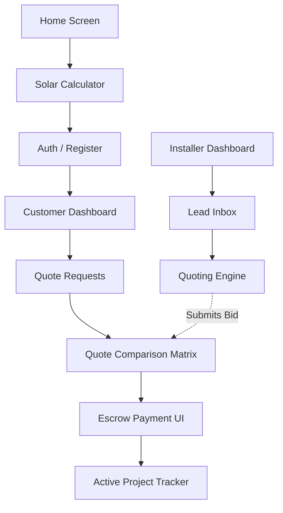

---
# COVER PAGE

**Document ID:** SHNG-WF-001
**Title:** Wireframe Specification
**Project Name:** Gridless Africa (formerly SolarHub NG)
**Version:** 1.0
**Date:** July 16, 2026
**Status:** Draft for Review
**Author:** Principal Product Designer / UI Architecture Team
**Intended Audience:** Product Designers, Frontend Engineers, QA Engineers, Product Managers
**Approval Status:** Pending

---

## Change Log

| Version | Date | Author | Summary of Changes |
| :--- | :--- | :--- | :--- |
| **1.0** | July 16, 2026 | Principal Product Designer | Initial Baseline. Aligned with PRD v1.0, Technical Architecture v1.0, and UX Strategy v1.0. |

## Related Documents & Dependencies
* **SHNG-CON-001** Project Constitution v1.0
* **SHNG-PRD-001** Product Requirements Document v1.0
* **SHNG-ARCH-001** Technical Architecture v1.0
* **SHNG-UX-001** UX Strategy v1.0
* **SHNG-IA-001** Information Architecture v1.0
* **SHNG-UF-001** User Flows v1.0

## Approval Workflow
1.  **Draft Review:** Lead Frontend Engineer & UX Architect (Pending)
2.  **Product Alignment:** Head of Product (Pending)
3.  **Final Sign-off:** CTO / Co-Founders (Pending)

---

## 1. Executive Summary
The Wireframe Specification (SHNG-WF-001) acts as the structural blueprint connecting our Information Architecture and UX Strategy to the final visual design. It defines the exact layout, content hierarchy, functional elements, and responsive behaviors of every screen before any typography, colors, or branding are applied. By standardizing widget placements, form behaviors, and state changes (loading, empty, error), this document ensures frontend engineering can begin building the component library in parallel with final UI rendering.

---

## 2. Wireframe Principles
*   **Mobile-First Layouts:** Wireframes are designed for a 375px viewport first. Desktop layouts are derived by expanding and dividing this base grid, never the reverse.
*   **Responsive Design:** Content reflows logically. Horizontal tables on desktop become stacked cards on mobile.
*   **Consistent Spacing:** An 8pt grid system dictates all padding and margins to ensure visual rhythm.
*   **Clear Visual Hierarchy:** The "F-Pattern" is utilized. Primary CTAs are always at the bottom of the viewport on mobile (thumb-friendly) or top-right of content cards on desktop.
*   **Accessibility (A11y):** Form fields explicitly reserve space for error text to prevent layout shifts. Focus order is mapped linearly.
*   **Progressive Disclosure:** Advanced settings (e.g., technical battery specifications) are hidden behind accordions or tabs.
*   **Performance-Conscious Layouts:** Reserving fixed height spaces for images/charts to avoid Cumulative Layout Shift (CLS).
*   **Trust-Building Elements:** Dedicated wireframe blocks for Escrow shields, KYC badges, and secure payment icons at critical transaction points.

---

## 3. Screen Inventory

### 3.1 Public
| Screen | ID | Core Purpose |
| :--- | :--- | :--- |
| Home | PUB-01 | Value proposition, entry to Calculator, trust signals. |
| Marketplace | PUB-02 | Category browsing, high-level product discovery. |
| Products | PUB-03 | Filterable list of hardware (Panels, Inverters). |
| Product Details | PUB-04 | Deep dive on specs, "Save", "Get Quote". |
| Installers | PUB-05 | Regional directory of verified professionals. |
| Installer Profile | PUB-06 | Bio, KYC badge, past jobs, reviews. |
| Solar Calculator | PUB-07 | Multi-step ROI & sizing tool (Flagship). |
| About & Contact | PUB-08 | Corporate info, support routing. |
| FAQ & Blog | PUB-09 | Education, objection handling, SEO content. |

### 3.2 Customer (Authenticated)
| Screen | ID | Core Purpose |
| :--- | :--- | :--- |
| Dashboard | CUS-01 | Next steps, active project alerts, health score. |
| Quote Requests | CUS-02 | Log of leads sent to marketplace. |
| Quote Comparison| CUS-03 | 3-bid side-by-side matrix & ROI breakdown. |
| Active Projects | CUS-04 | Escrow status, milestone timeline tracker. |
| Payments | CUS-05 | Paystack initialization, transaction receipts. |
| Maintenance | CUS-06 | Booking future service (Phase 2 foundation). |
| Warranties | CUS-07 | Digital certificates repository. |
| Messages & Notifs| CUS-08 | Inbox for installer chats and system alerts. |
| Profile & Settings| CUS-09 | Personal details, security, saved items. |

### 3.3 Installer (Authenticated)
| Screen | ID | Core Purpose |
| :--- | :--- | :--- |
| Dashboard | INS-01 | Profile views, earnings summary, quick actions. |
| Leads | INS-02 | Geofenced inbox of available quote requests. |
| Quotes | INS-03 | Active bids and quoting engine form. |
| Jobs | INS-04 | Kanban board of active installations. |
| Products | INS-05 | Saved marketplace hardware for quick quoting. |
| Earnings | INS-06 | Ledger of Escrow payouts. |
| Profile & Settings| INS-07 | KYC upload wizard, CAC docs, public bio. |

### 3.4 Admin (Authenticated)
| Screen | ID | Core Purpose |
| :--- | :--- | :--- |
| Dashboard | ADM-01 | Command center (GMV, pending KYC alerts). |
| User Management | ADM-02 | View, suspend, or impersonate users. |
| KYC Verification| ADM-03 | Document viewer and approve/reject controls. |
| Product Mgmt | ADM-04 | Approve/edit marketplace hardware listings. |
| Analytics & Reports| ADM-05 | System-wide performance metrics. |
| Support & Audit | ADM-06 | Dispute resolution and immutable action logs. |

---

## 4. Detailed Screen Specifications (Core Paths)

*(Note: To maintain document conciseness, detailed layout specs are provided for the primary interaction screen of each persona. These establish the component patterns used across the rest of the portal).*

### 4.1 Solar Savings Calculator (PUB-07)
*   **Target User:** Guest Visitor / Potential Customer.
*   **Entry Points:** Home Page CTA, Marketplace CTA.
*   **Exit Points:** Sign Up / Login Modal, Quote Request Submission.
*   **Layout Structure:** Centered card (Desktop) / Fullscreen wizard (Mobile). Progress bar fixed at top.
*   **Required UI Sections:**
    *   Step Indicator (1 of 4).
    *   Question Title (e.g., "What appliances do you run?").
    *   Input Grid (Icon-based counter for ACs, TVs, etc.).
*   **Primary Action:** `Next Step` (Sticky bottom button).
*   **Secondary Action:** `Back`.
*   **API Dependencies:** `POST /api/v1/calculator/calculate`.
*   **DB Entities:** N/A (Calculated in-memory until saved).
*   **Permissions:** Public.

### 4.2 Customer Quote Comparison (CUS-03)
*   **Target User:** Customer.
*   **Entry Points:** Customer Dashboard > Quote Requests.
*   **Layout Structure:**
    *   *Mobile:* Vertical stacked cards (1 card per bid). Swipeable.
    *   *Desktop:* 3-column comparative matrix.
*   **Required UI Sections:**
    *   Header: Project Summary (e.g., "5kVa Hybrid Setup - Akobo").
    *   Bid Columns: Installer Name, Rating Badge, Total Cost, Hardware Breakdown, Labor, Warranty.
    *   Highlight Widget: "Lowest Price" or "Top Rated" ribbon on applicable columns.
*   **Primary Action:** `Accept Quote` (Triggers confirmation modal).
*   **Secondary Action:** `Message Installer`, `Reject Quote`.
*   **API Dependencies:** `GET /api/v1/quotes`, `PATCH /api/v1/quotes/{id}/accept`.
*   **DB Entities:** `quotes`, `quote_line_items`, `installer_profiles`.

### 4.3 Installer Quoting Engine (INS-03)
*   **Target User:** KYC-Verified Installer.
*   **Entry Points:** Installer Leads Inbox.
*   **Layout Structure:** Split screen (Desktop). Left: Customer Lead Details. Right: Quoting Form.
*   **Required UI Sections:**
    *   Lead Data Panel: Required kVa, Budget Tier, Location.
    *   Line Items Form: Dynamic list. Fields for `Product Search/Autocomplete`, `Quantity`, `Unit Price`.
    *   Cost Summary Block: Auto-calculating subtotal + Labor Cost Input + Platform Fee (Static) = Total Bid.
*   **Primary Action:** `Submit Bid`.
*   **API Dependencies:** `POST /api/v1/quotes`.
*   **DB Entities:** `quotes`, `quote_line_items`.

### 4.4 Admin KYC Verification (ADM-03)
*   **Target User:** Administrator.
*   **Entry Points:** Admin Dashboard > KYC Alerts.
*   **Layout Structure:** Standard Admin Sidebar. Main content area split horizontally.
*   **Required UI Sections:**
    *   Top: Installer Profile Info (Name, Business Reg Number).
    *   Middle: PDF/Image Viewer (for CAC documents and IDs).
    *   Bottom: Action panel.
*   **Primary Actions:** `Approve KYC` (Green), `Reject KYC` (Red).
*   **Secondary Action:** `Request More Info` (Opens text area).
*   **API Dependencies:** `PATCH /api/v1/admin/kyc/{id}`.
*   **DB Entities:** `installer_profiles`, `kyc_documents`.

---

## 5. State Definitions

*   **Initial Loading State:** Full-page branded splash screen only on initial PWA boot.
*   **Skeleton Loading:** Used for all data fetches (e.g., gray pulsing blocks matching the shape of Quote Cards or Catalog Items) to minimize CLS.
*   **Empty State:** Illustrated graphic + Explanatory text + Primary CTA.
    *   *Example:* "No Active Projects. Start by running the Solar Calculator!" + `[Calculate Savings]` button.
*   **Success State:** Inline green checkmarks for form fields. Full screen celebratory confetti/shield illustration for Escrow funding.
*   **Error State:** Red inline text for validation. Toast notifications for transient API failures.
*   **Offline State:** Gray banner fixed to top: "You are viewing cached data. Check your connection." Form submit buttons are disabled.

---

## 6. Responsive Behaviour

*   **Mobile (375px - 767px):**
    *   1-column layout.
    *   Global navigation shifts to a Bottom Tab Bar (Home, Inbox, Projects, Profile).
    *   Complex data tables (Admin/Installer) collapse into stacked cards with "Expand" carets.
*   **Tablet (768px - 1023px):**
    *   2-column layout.
    *   Bottom tab bar disappears. Replaced by a collapsible left-hand sidebar.
    *   Popovers and Modals take up 70% of screen width (centered).
*   **Desktop (1024px+):**
    *   Persistent left-hand sidebar (250px width).
    *   Fluid content area with max-width limits (1200px) to prevent readability issues on ultrawide monitors.
    *   Modals use standard fixed widths (e.g., 500px, 800px).

---

## 7. Accessibility Requirements
*   **Keyboard Navigation:** All interactive elements (`<button>`, `<a>`, `<input>`) must follow logical DOM order.
*   **Focus Order:** `Outline: 2px solid #PrimaryBrandColor` for all focused states. Modals must trap focus until closed.
*   **Screen Reader Support:** Use `aria-hidden="true"` on decorative icons. Use `aria-live="polite"` on the Calculator cost estimation updates.
*   **Color Contrast:** Placeholder text in forms must meet the 4.5:1 ratio against background inputs. Warning states (yellow/orange) must have dark text.
*   **Form Accessibility:** All inputs must have associated, visible `<label>` tags (no relying solely on placeholders).

---

## 8. Navigation Behaviour
*   **Top Navigation (Public):** Logo left. Links center. `Sign In` / `Get Quotes` buttons right. Sticks to top on scroll.
*   **Sidebar Behaviour (Auth):** Displays active state (highlighted background). Contains user avatar and role badge at the bottom.
*   **Bottom Navigation (Mobile):** Fixed position. Hides automatically when user scrolls down (to maximize screen real estate), reappears on scroll up.
*   **Breadcrumbs:** Implemented on Marketplace `Marketplace > Inverters > Sunsynk 5kVa` and Admin views.
*   **Back Navigation:** Native browser back button behavior must be respected. Overriding history is forbidden.

---

## 9. Form Specifications
*   **Validation:** Triggered `onChange` after initial blur.
*   **Error Handling:** Red border on input + explicit error message below (e.g., "Amount must be greater than ₦0").
*   **Confirmation States:** Critical forms (Submitting Quote, Admin Rejections) change button state to a spinner -> then to a "Success" icon before redirecting.
*   **Save Behaviour:** "Auto-save draft" utilized on the Installer Quoting Engine.
*   **Cancel Behaviour:** "Cancel" buttons act as secondary ghost buttons and revert to the previous route.

---

## 10. Dashboard Layouts

### 10.1 Customer Dashboard
1.  **Top:** System Health Score (Empty/Grey if no project yet).
2.  **Hero Widget:** "Next Action" Block (e.g., "You have 2 quotes waiting for review").
3.  **Secondary Grid:** 
    *   Active Projects Tracker.
    *   Maintenance Reminders.

### 10.2 Installer Dashboard
1.  **Top:** Performance Metrics Row (Total Earned, Active Jobs, Profile Views).
2.  **Main Widget:** Kanban view of Leads/Quotes (New Lead -> Quoted -> Accepted).
3.  **Sidebar Widget:** Recent Customer Reviews.

### 10.3 Admin Dashboard
1.  **Top Alert Bar:** System health & API status.
2.  **Priority Action Widget:** KYC Applications awaiting review (Sorted oldest first).
3.  **Metrics Grid:** GMV (Escrow), Total Active Projects, Dispute Flags.

---

## 11. Future Screen Reservations
*   **AI Energy Consultant (Phase 2):** A persistent FAB in the bottom right corner of authenticated screens. Expands into a slide-over panel.
*   **Financing Portal (Phase 2):** On the Quote Acceptance modal, space is reserved for a split decision: "Fund via Escrow" vs. "Apply for Financing".
*   **Binance Wallet (Phase 3):** Authentication modal wireframes contain a disabled block labeled `[Web3 Connector Placeholder]`.
*   **IoT Monitoring (Phase 3):** Customer dashboard structure reserves a full-width block below the Health Score for future live telemetry charts.

---

## 12. Screen Relationships

---

## 13. Wireframe Risks & Mitigation

| Risk | Description | Mitigation Strategy |
| :--- | :--- | :--- |
| **Complex Tables on Mobile** | Quote comparison matrix involves 10+ data points per installer. | **Mitigation:** Implement stacked cards with a horizontal swipe interaction. Lock the data labels on the left while the user swipes through Installer A, B, and C. |
| **Fat-Finger Errors** | Accidental quote submission on mobile screens. | **Mitigation:** Utilize full-width sticky buttons at the bottom of the viewport for primary actions, requiring deliberate presses, and implement a confirmation bottom-sheet for destructive actions. |
| **Long Scrolling Forms** | Installer Quoting Engine becoming unwieldy with multiple line items. | **Mitigation:** Break the form into logical accordions (Hardware, Labor, Terms) and utilize a sticky summary bar for the Total Price. |

---

## 14. Wireframe Recommendations (WFRs)

### WFR 001: Sticky "Total Cost" Bar in Quoting Engine
*   **Context:** As installers add multiple line items (panels, batteries, cables), the total cost gets pushed below the viewport.
*   **Recommendation:** Implement a sticky footer bar inside the Installer Quoting Engine that persistently displays the `Subtotal`, `Platform Fee`, and `Total Bid Amount` while the user scrolls through line items. This reduces cognitive load and prevents calculation errors.

---

**Approval Checklist**
- [ ] Mobile-first grid layouts are explicitly defined.
- [ ] Trust signals and Escrow badges are mapped to wireframe locations.
- [ ] Progressive disclosure is utilized for complex specs.
- [ ] Screen relationships accurately map the PRD/UF flows.

*Document Footer: Gridless Africa - Wireframe Specification v1.0*